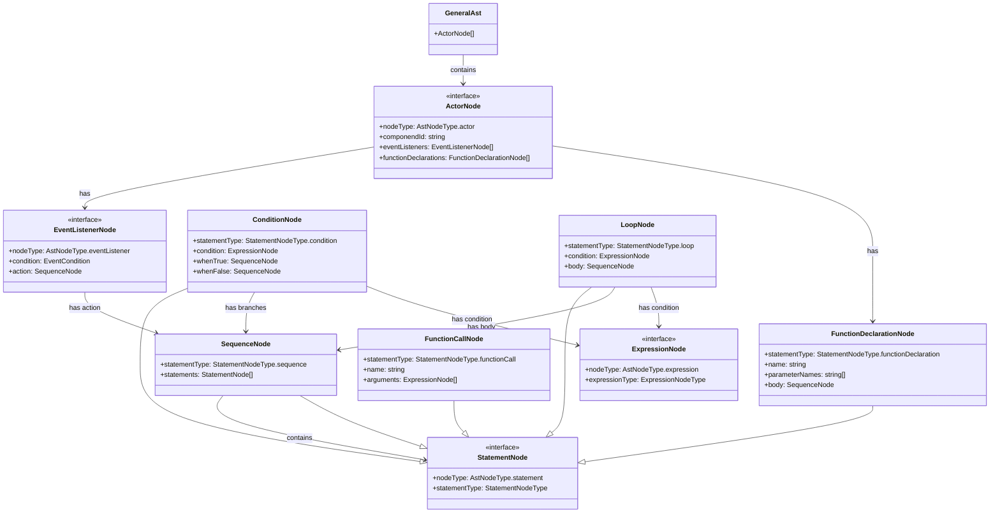
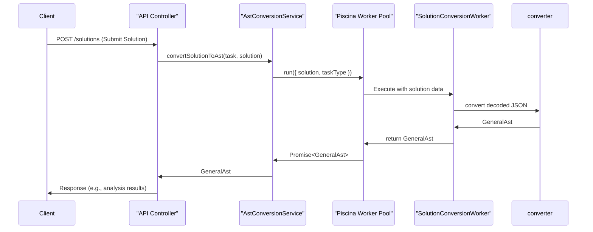

# AST conversion

The Abstract Syntax Tree (AST) conversion is a core backend feature responsible for transforming student-submitted solutions from their original format (e.g., Scratch project JSON) into a standardized, language-agnostic General AST. This unified representation allows for consistent analysis, comparison, and processing of solutions, regardless of the source programming environment.

The process is initiated when a solution is submitted. The resulting General AST is a structured tree of nodes representing the program's logic, including actors, event listeners, control flow, and expressions. This AST serves as the input for further analysis modules within ClassMosaic.

## Overview

In the `backend`, ClassMosaic converts each result in a Generalized Abstract Syntax Tree (G-AST). This structure makes it possible to calculate similarities and differences between solutions.

The `/frontend` then performs the analysis and displays the results to the teacher.

The translation is deterministic: the same code is always translated to the same G-AST.

In addition, **the translation process normalizes certain syntactic constructs**. For example:

- Any kind of loop is represented as a single `loop` node type, with the condition determined by the specific loop construct being translated.
- Operators are unified under a generalized `operator` node type, which can represent any operator (`+`, `-`, `|`, `||`, etc.) with an arbitrary number of operands.

Each programming language has its own converter, combining both a shared grammar.

## Generalized Abstract Syntax Tree (G-AST)

We use standard graph theory terminology when referring to the G-AST with the caveat that we use *(tree) node* instead of *vertex* to make it explicit we are talking about a tree and not a general graph.
A **child** $c$ of a node $p$ is a node with a directed edge from parent $p$ to child $c$: $p \to c$.

At the top level, a generalized G-AST consists of a list of *actor* nodes.
An actor may be a Scratch target (the stage, a cat, etc.), a C program or even a service such as an HTTP service.

On the next level, each actor has an arbitrary set of *event listener* children.
Each of those event listeners consists of a *condition* and an *action* child.
Such an event listener may represent a Scratch hat block, a C program's main function or an endpoint of an API.

The condition of an event listener is described by a string and a list of *expression* children.
The action of an event listener is described by a *statement* sequence.

Expressions are different from statements in the aspect of having a value.
For instance a literal is an expression whereas a control structure such as a condition or a variable assignment/declaration is a statement.

### Structure

The diagram below shows the main interfaces that constitute the General AST.



### Example

If each programming language has its own features and needs a specific converter, we purpose a simple example to illustrate a conversion.

```c#
func sum(a, 3):
    return a+3
```
This function will be converted to JSON like this:

```json
{
    "nodeType": "statement",
    "statementType": "functionDeclaration",
    "name": "sum",
    "parameterNames": ["a", "3"],
    "body": {
        "nodeType": "statement",
        "statementType": "sequence",
        "statements": [
            {
                "nodeType": "statement",
                "statementType": "return",
                "value" : {
                    "nodeType": "expression",
                    "expressionType": "operator",
                    "operator": "+",
                    "operands": [
                        {
                            "nodeType": "expression",
                            "expressionType": "variable",
                            "name": "a"
                        },
                        {
                            "nodeType": "expression",
                            "expressionType": "literal",
                            "type": "number",
                            "value": "3"
                        }
                    ]
                }
            }
        ]
    }
}
```

## Backend architecture

The backend conversion process is managed by the AstConversionService and executed by a worker pool. This design offloads CPU-intensive parsing from the main event loop. ClassMosaic uses [Piscina.js](https://piscinajs.dev/) as worker pool library for Node.js.


### Components

| Component | Description | Source File |
| --------- | ----------- | ----------- |
| `AstConversionService` | A NestJS injectable service that orchestrates the conversion. It receives a task and a solution, determines the correct conversion path, and invokes the worker. | backend/src/ast/ast-conversion.service.ts |
| `Piscina` Worker Pool | A worker thread pool used by `AstConversionService` to run the conversion logic in a separate process. This prevents blocking the main Node.js event loop. | backend/src/ast/ast-conversion.service.ts |
| `SolutionConversionWorker` | The script executed by the Piscina worker. It receives the solution data, decodes it, and calls the appropriate language-specific converter (e.g., for Scratch). | backend/src/ast/converters/solution-conversion-worker.piscina.ts` |
| converter | A specific converter function that transforms the task solution into the General AST format. See [G-AST Converters](#g-ast-converters). | |

### Data flow

The following diagram illustrates the sequence of operations for converting a solution to a General AST on the backend. Each programming language app has a specific converter.



## G-AST Converters

- [Scratch](scratch/g-ast-converter.md)
- [Python](python/g-ast-converter.md)
