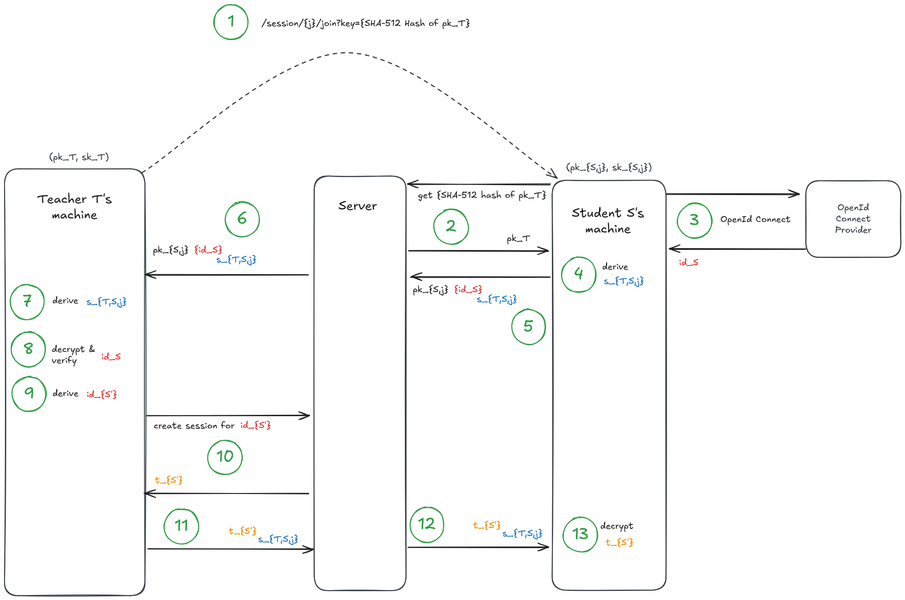

# Student identity management

## Overview

The system uses pseudonyms to track student activity across sessions while protecting student identities from the server. The server is assumed to be an "honest-but-curious" (semi-honest) adversary: it follows the protocol but may try to learn extra information from what it stores.

The goal is to ensure that teachers can associate a student's identity with their pseudonym, without allowing the server to link the two.

## Key setup

Each teacher generates a public/private key pair:
- The **public key** is stored on the server directly
- The **private key** is encrypted client-side using a password-derived key before being stored on the server

This ensures the server never has access to the teacher's private key in plaintext.

## How students join a session

### 1. Teacher's public key verification

The student receives a session link from their teacher, containing a SHA-512 fingerprint of the teacher's public key.

When the student opens the link, their browser:
1. fetches the teacher's public key from the server and
2. verifies the fingerprint matches

Note that, assuming the link is distributed via a trusted, authenticated channel, like Teams or a classroom whiteboard, the server cannot substitute a different key; any tampering would cause a fingerprint mismatch.

### 2. OpenID Connect authentication

The student authenticates via OpenID Connect directly with the identity provider (e.g., Microsoft, Google). The ClassMosaic server is not involved in this exchange.

### 3. Secure key exchange with the teacher

After authentication, the student's browser:
1. generates a session-specific ephemeral key pair,
2. performs a Diffie-Hellman key exchange with the teacher's public key to derive a shared secret,
3. sends to the teacher (via the server):
   - The student's ephemeral public key
   - The student's identity encrypted with the shared secret

The server forwards this message but cannot read the encrypted identity.

### 4. Teacher verification

The teacher's browser:
1. derives the same shared secret using the student's ephemeral public key and the teacher's private key,
2. decrypts and verifies the student's identity and OpenID Connect token,
3. assigns a pseudonym to the student,
4. requests an authentication token from the server for this pseudonym,
5. sends the token back to the student, encrypted with the shared secret.

This verification step is critical — without it, the server could impersonate students.

### 5. Session communication

The student decrypts the authentication token and uses it for all subsequent communication with the server. The server only sees the pseudonym, not the real identity.

## Security properties

**Forward secrecy:** Because students generate ephemeral keys for each session, compromising a teacher's long-term private key does not expose past session communications.

**Traffic analysis consideration:** If the server proxies messages, it could potentially correlate requests by timing. Random delays or message reordering can mitigate this.

## Technical details

This section provides a more formal description of the protocol for those interested in the cryptographic details.

Each teacher $T$ generates a long-term public/private key pair $(\mathrm{pk}_{T}, \mathrm{sk}_{T})$ where the public key $\mathrm{pk}_{T}$ is stored by the server directly and the private (or secret) key $\mathrm{sk}_{T}$ is stored on the server only *after* the teacher's machine encrypted it locally using a symmetric key $k_{p}$ derived from a password $p$.

When a student $S$ wants to join a session $j$, they click on the link they receive from their teacher.
This link contains a fingerprint (SHA-512 hash) of the teacher's public key allowing the student's machine to authenticate the teacher's public key.
Using the fingerprint, the student's machine can retrieve the public key from the server and verify its fingerprint.
Note that, assuming the link is distributed via a trusted, authenticated channel, (blackboard, teams, ...) the server does not get the chance to manipulate the link and therefore cannot send a different key to the student without them noticing after verifying the fingerprint.

In order to authenticate, student $S$ then performs the OpenId Connect flow with some provider where the application is a public client meaning the server is not involved in the protocol.
After receiving an id token containing the identifier $\mathrm{id}_{S}$, the student's machine generates a session-specific ephemeral keypair $(\mathrm{pk}_{S,j}, \mathrm{sk}_{S,j})$ and performs a Diffie-Hellman key exchange with the teacher.
Since student $S$ already knows $\mathrm{pk}_{T}$, it can already derive the shared symmetric ephemeral secret $s_{T,S,j}$ and send both, the public key $\mathrm{pk}_{S,j}$ required for the Diffie-Hellman key exchange and the identity $\mathrm{id}_{S}$ encrypted under the ephemeral shared secret $s_{T,S,j}$, i.e. $\{\mathrm{id}_{S}\}_{s_{T,S,j}}$, to the teacher. 

Note that this message does not contain any confidential information and the server can therefore be relied upon for forwarding the message.
An impersonation of a student is not feasible for the server as it would require the server to forge a valid id token which we assume it cannot (i.e. we hope for the student to protect their authentication methods at the OpenId Connect provider).

After $T$ receives $\mathrm{pk}_{S,j}$ and $\{\mathrm{id}_{S}\}_{s_{T,S,j}}$, they can derive $s_{T,S,j}$ from $\mathrm{pk}_{S,j}$ and $\mathrm{sk}_{T}$.
This in turn enables $T$ to decrypt the identity and check the validity of the OpenId Connect token.
Note that this step is mandatory, as otherwise the server could impersonate any student.

After doing so $T$ determines some pseudonym $\mathrm{id}_{S'}$ for $S$ and requests an authentication token from the server.
Once the server issues an authentication token $t_{S'}$, $T$ sends the authentication token $t_{S'}$ to the student encrypted under the ephemeral key $s_{T,S,j}$, i.e. $\{t_{S'}\}_{s_{T,S,j}}$.

Finally, $S$ decrypts the authentication token $t_{S'}$ for its pseudonym $S'$ and can start communicating with the server.

Note that it is advisable to introduce random delays or shuffling of the order of messages to prevent the server from correlating different requests and deducing a student's identity, especially if the server is used for proxying the messages.

By generating an ephemeral key for communication, the student gets the guarantee for perfect forward secrecy with respect to the exchanged messages.
Note that the teacher does not get this guarantee as it does not generate an ephemeral key (this is different from TLS); although in reality, since students have an interest in PFS, they will generate an ephemeral key resulting in PFS for both parties.
