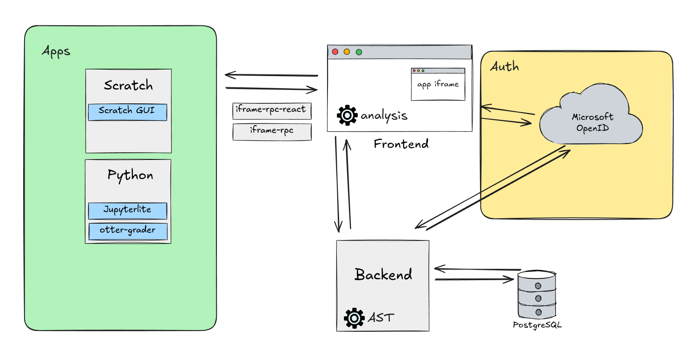

# Overview of the ClassMosaic modules

ClassMosaic is composed of several modules that communicate and work together. The diagram below provides a visual overview of these modules.

## Frontend: NextJS

The `/frontend` is responsible for:

- Creating classes, lessons and tasks.
- Displaying app iframes (e.g., Scratch).
- Participating in [identity management](../identity-management/student.md).
- Performing analysis to compare task results.

## Backend: NestJS

The `/backend` module has three main responsibilities:

- Handling database requests.
- Storing keys to bridge students, teachers, and the OpenID provider.
- Converting task results into a [Generalized Abstract Syntax Tree (G-AST)](../data-analyzer/ast.md)

## Libraries : iframe-rpc

- `iframe-rpc` is used by apps to exchange data with the frontend in an platform-agnostic way.
- Conversely, `iframe-rpc-react` is used by the frontend to communicate with apps.

## Apps

An app implements a programming language within ClassMosaic.

Currently supported apps:

- [Scratch](../scratch/modifications.md)

Planned future apps:

- Python
