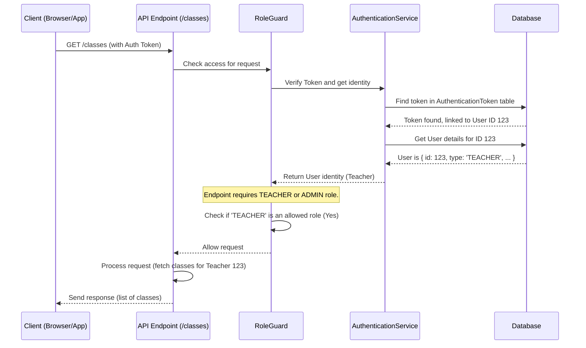

# Chapter 1: User & Student Identity

Welcome to the `api` project! This tutorial will guide you through its core concepts, starting with the very foundation: understanding who interacts with the system.

Imagine our project is like a digital school. In any school, you have different people with different roles: teachers who manage classes, administrators who manage the school, and students who learn. Our system needs a way to tell these different types of people apart, because what they can *do* and *see* is very different. This chapter explains how we define and manage these identities.

## Who's Who? Users vs. Students

In our system, we have two main categories of actors: **Users** and **Students**. Think of it like having staff badges versus student IDs or visitor passes in a real school.

### Users: The Platform Managers

*   **Analogy:** Teachers and School Administrators.
*   **Who they are:** These are the people who run the show behind the scenes. They create courses (called "Classes" in our system), design learning activities ("Tasks"), manage student access, and generally keep the platform running smoothly.
*   **How they're identified:** Users log in using their email address and a standard secure method called **OIDC** (OpenID Connect). Don't worry too much about the acronym; just think of it as logging in securely using an existing account, like a Microsoft school account. This confirms their identity reliably.
*   **Permissions:** Because they manage the platform, Users have broader permissions. They can create, view, update, and delete various pieces of data like classes and tasks.

```typescript
// A simplified view of what User data might look like
type UserIdentity = {
  id: number; // Unique ID for the user
  email: string; // Their login email
  type: 'ADMIN' | 'TEACHER'; // What kind of user?
  // ... other details like name, OIDC info
};
```

This structure helps the system know who the user is (`id`, `email`) and what role they have (`type`).

### Students: The Learners

*   **Analogy:** Students attending classes or workshops.
*   **Who they are:** These are the individuals participating in the learning sessions created by Users (Teachers).
*   **How they're identified:** This is where it gets interesting! Students can interact in two ways:

    1.  **Authenticated Students:**
        *   **Analogy:** Registered students officially enrolled in a specific class.
        *   **How:** They are linked to a specific `Class` using a **pseudonym** (like a unique nickname or code) provided by the teacher. This protects their real identity while still allowing the system to track their progress within that class over time.
        *   **Persistence:** Their participation and work (like submitted solutions) are saved and associated with their pseudonym within that class.

    2.  **Anonymous Students:**
        *   **Analogy:** Guest students or visitors attending a one-off workshop.
        *   **How:** They join a specific learning `Session` temporarily, without needing to be pre-registered in a `Class`. They don't have a persistent pseudonym linked across sessions.
        *   **Persistence:** Their participation is typically limited to that single session. While they might submit work during the session, it's not tracked under a persistent identity across different classes or longer periods.

```typescript
// A simplified view of what Student data might look like
type Student = {
  id: number; // Unique ID for this student instance
  authenticatedStudent: { // Info if they are authenticated
    classId: number;
    pseudonym: Buffer; // The unique pseudonym (stored securely)
  } | null; // Null if not authenticated this way
  anonymousStudent: { // Info if they are anonymous
    sessionId: number;
  } | null; // Null if not anonymous
};
```

This structure allows the system to know if a student is tied to a specific class (`authenticatedStudent`) or just a temporary session (`anonymousStudent`).

### Why Does This Distinction Matter?

This separation is crucial for **permissions** and **data access**:

*   A `Teacher` (User) needs to see all student submissions for their `Class`.
*   An `Authenticated Student` should only see their *own* submissions within their `Class`.
*   An `Anonymous Student` might only interact within the `Session` they joined.
*   An `Admin` (User) might need oversight over multiple classes or users.

The system uses these identities to enforce these rules, ensuring privacy and proper functionality. This is a core part of [Authentication & Authorization](04_authentication___authorization_.md).

## How the System Knows Who You Are

When someone interacts with the `api` (e.g., through a web application), every request they send needs to tell the system who they are. This is done using **Authentication Tokens**.

1.  **Login:** A User logs in via OIDC, or a Student joins a session (authentically or anonymously).
2.  **Token Issuance:** The system verifies their identity and gives them back a unique, secret string of characters – the **Authentication Token**. Think of it as a temporary, digital ID card.
3.  **Making Requests:** For every subsequent action (like fetching classes or submitting an answer), the User/Student includes this token in their request.
4.  **Verification:** The `api` receives the request, looks at the token, and verifies it. If valid, it knows exactly who is making the request and what type of actor they are (Admin, Teacher, Authenticated Student, Anonymous Student).

The `AuthenticationService` (found in `authentication/authentication.service.ts`) is the main component responsible for issuing and verifying these tokens.

```typescript
// authentication/authentication.service.ts (simplified concept)

class AuthenticationService {
  // ... other methods ...

  // Checks a token and returns the User or Student it belongs to
  async findUserByAuthTokenOrThrow(token: string): Promise<User | Student> {
    // 1. Look up the token in the database
    // 2. Check if it's expired
    // 3. Fetch the associated User or Student details
    // 4. Return the User or Student object
    // ... implementation details ...
  }

  // Checks if the identity object represents a Student
  isStudent(user: User | Student): user is Student {
    // ... checks if it has student-specific properties ...
  }
}
```

This service acts like a security guard, checking the ID card (token) of everyone trying to access different parts of the system.

## Accessing Identity in Code

Inside the `api`'s code (specifically in controllers that handle incoming requests), we often need to know *who* made the request to tailor the response or check permissions. NestJS (the framework used by `api`) provides helpful tools called **Decorators** for this.

```typescript
// authentication/authenticated-user.decorator.ts (simplified)
import { createParamDecorator, ExecutionContext } from "@nestjs/common";
// ... imports ...

// This decorator makes it easy to get the User object in a controller
export const AuthenticatedUser = createParamDecorator(
  (_data: unknown, context: ExecutionContext) =>
    // Gets the user info attached to the request context
    AuthenticationService.getKeyFromContext(context, "user"), // "user" is the key used
);
```

```typescript
// authentication/authenticated-student.decorator.ts (simplified)
import { createParamDecorator, ExecutionContext } from "@nestjs/common";
// ... imports ...

// This decorator does the same, but for Students
export const AuthenticatedStudent = createParamDecorator(
  (_data: unknown, context: ExecutionContext) =>
    // Gets the student info attached to the request context
    AuthenticationService.getKeyFromContext(context, "student"), // "student" is the key used
);
```

These decorators (`@AuthenticatedUser()` and `@AuthenticatedStudent()`) allow developers to easily grab the identity information within their code, without needing to manually handle tokens everywhere.

Example Usage in a Controller (Conceptual):

```typescript
// users/users.controller.ts (simplified example)
import { Controller, Get, Param } from "@nestjs/common";
import { AuthenticatedUser } from "../authentication/authenticated-user.decorator";
import { User } from "@prisma/client";

@Controller("users")
class UsersController {
  @Get("me") // An endpoint to get the current user's profile
  getMyProfile(@AuthenticatedUser() user: User) {
    // Thanks to the decorator, 'user' contains the User object
    // making the request, if they are authenticated as a User.
    console.log(`Request made by User ID: ${user.id}, Email: ${user.email}`);
    // ... return user profile data ...
  }
}
```

## Under the Hood: How Verification Works

Let's trace what happens when a request with a token arrives:

1.  **Request In:** Your browser (Client) sends a request like `GET /classes` to the API, including the `AuthenticationToken` in the headers.
2.  **Guard Intercepts:** Before the request reaches the main logic for `/classes`, a special piece of code called `RoleGuard` (from `authentication/role.guard.ts`) intercepts it. Its job is to check if the requester is allowed to access this endpoint.
3.  **Token Check:** The `RoleGuard` extracts the token from the request.
4.  **Ask AuthenticationService:** It passes the token to the `AuthenticationService`.
5.  **Database Lookup:** `AuthenticationService` looks up the token in its `AuthenticationToken` table in the database. This table links tokens to `userId`s or `studentId`s and tracks when the token was last used (to handle expiration).
6.  **Identity Found:** If the token is valid and not expired, the `AuthenticationService` retrieves the full `User` or `Student` details from the database.
7.  **Attach Identity:** `AuthenticationService` attaches the retrieved `User` or `Student` object to the current request's context (a temporary storage for information about the request). It uses helper functions like `AuthenticationService.setKeyOnContext`.
8.  **Role Check:** `RoleGuard` now knows *who* the requester is (e.g., a Teacher) and *what* roles are allowed for the `/classes` endpoint (e.g., maybe only Teachers and Admins). It checks if the requester's role matches the allowed roles.
9.  **Access Granted/Denied:**
    *   If allowed, `RoleGuard` lets the request proceed to the actual controller logic (like fetching the classes).
    *   If denied, `RoleGuard` stops the request and sends back an error (like "Unauthorized" or "Forbidden").

Here's a simplified diagram of that flow:



Key code snippets involved:

*   **Guard using the Service:**

    ```typescript
    // authentication/role.guard.ts (simplified snippet)
    async canActivate(context: ExecutionContext): Promise<boolean> {
      // ... get token ...
      try {
        // Use the service to find the identity based on the token
        const userOrStudent = await this.authenticationService.findUserByAuthTokenOrThrow(token);

        if (this.authenticationService.isStudent(userOrStudent)) {
           // ... handle student ...
           // Attach student identity to the request context
           AuthenticationService.setKeyOnContext<Student>(context, studentRequestKey, userOrStudent);
        } else {
           // ... handle user (Teacher/Admin) ...
           // Attach user identity to the request context
           AuthenticationService.setKeyOnContext<User>(context, userRequestKey, userOrStudent);
        }
        // ... check roles ...
      } catch (e) {
        // Handle errors like invalid token
      }
      // ... return true if allowed, false otherwise ...
    }
    ```

*   **Service finding the token:**

    ```typescript
    // authentication/authentication.service.ts (simplified snippet)
    async findUserByAuthTokenOrThrow(token: AuthToken): Promise<User | Student> {
      const authToken = await this.prisma.authenticationToken.findUniqueOrThrow({
        where: { token }, // Find the token in the DB
        include: { // Also fetch the linked user or student
          user: true,
          student: { include: { authenticatedStudent: true, anonymousStudent: true } },
        },
      });
      // ... update last used time ...
      // Return the user or student object found
      return authToken.user ?? authToken.student;
    }
    ```

*   **Decorator getting the identity:**

    ```typescript
    // authentication/authenticated-user.decorator.ts (uses helper)
    export const AuthenticatedUser = createParamDecorator(
      (_data: unknown, context: ExecutionContext) =>
        // This helper retrieves the value set by setKeyOnContext
        AuthenticationService.getKeyFromContext(context, userRequestKey),
    );
    ```

## Conclusion

You've learned about the fundamental concept of **User & Student Identity** in the `api` project.

*   **Users** (Admins, Teachers) manage the platform and are identified by email/OIDC.
*   **Students** participate in learning and can be **Authenticated** (linked to a class via pseudonym) or **Anonymous** (temporary session access).
*   This distinction controls permissions and data visibility, enforced using **Authentication Tokens** verified by the `AuthenticationService` and `RoleGuard`.
*   Decorators like `@AuthenticatedUser` make it easy to access identity information in the code.

Understanding who is interacting with the system is the first step. Now that we know *who* the actors are, let's explore *what* they interact with.

Next, we'll dive into the core data structures these users and students work with: [Chapter 2: Entity Modules (Classes, Tasks, Users)](02_entity_modules__classes__tasks__users__.md).

---

Generated by [AI Codebase Knowledge Builder](https://github.com/The-Pocket/Tutorial-Codebase-Knowledge)