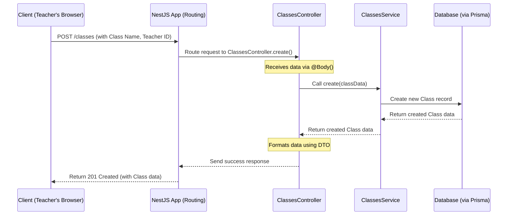

# Chapter 2: Entity Modules (Classes, Tasks, Users)

In [Chapter 1: User & Student Identity](01_user___student_identity_.md), we learned *who* interacts with our `api` project – the different types of Users and Students. Now, let's explore *what* they interact with and how the project is organized to handle these interactions.

## Keeping the Kitchen Tidy: Why Organize Code?

Imagine trying to cook a big meal in a kitchen where all the ingredients, pots, pans, and utensils are just thrown into one giant pile. It would be chaotic and inefficient! Finding what you need would be a nightmare.

Software projects, especially larger ones like our `api`, can become similarly messy if not organized well. If all the code for handling classes, tasks, users, sessions, and everything else was mixed together in just a few giant files, it would be very hard to:

*   **Understand:** Figure out where the code for a specific feature (like creating a new class) actually lives.
*   **Maintain:** Fix bugs or make changes without accidentally breaking something unrelated.
*   **Collaborate:** Allow multiple developers to work on different parts of the project simultaneously without stepping on each other's toes.

This is where **Modules** come in. They are like organizing your kitchen into labeled cupboards and drawers – one for pots, one for spices, one for baking tools.

## Meet the Departments: Entity Modules

Our `api` project is organized into **Modules**, where each module is responsible for one core concept or "entity". Think of these entities as the main "things" the API manages, like:

*   `Classes`: Representing courses or learning groups.
*   `Tasks`: Representing assignments or activities within a class.
*   `Users`: Representing the teachers and administrators managing the platform.
*   `Sessions`: Representing specific instances of a class being run. (We'll cover this in [Chapter 3: Sessions](03_sessions_.md))
*   `Solutions`: Representing student submissions. (Covered in [Chapter 5: Solutions & Analysis](05_solutions___analysis_.md))

Each of these entities has its own dedicated module (a folder with specific files). This is like having different departments in a company: the "Classes Department", the "Tasks Department", the "Users Department", etc. Each department handles its own specific responsibilities.

### Inside a Department (Module)

Typically, each entity module contains a few key components:

1.  **Controller (`*.controller.ts`): The Reception Desk**
    *   **Analogy:** The friendly receptionist at the front desk of a department.
    *   **Job:** Handles incoming web requests related to its entity. For example, `classes.controller.ts` handles requests like `GET /classes` (list all classes) or `POST /classes` (create a new class).
    *   **How:** It figures out what the request wants and passes the work off to the correct "back office" person (the Service). It doesn't do the heavy lifting itself.

2.  **Service (`*.service.ts`): The Back Office / Engine Room**
    *   **Analogy:** The skilled workers in the back office who actually perform the tasks.
    *   **Job:** Contains the core "business logic" – the actual steps needed to manage the entity. For the `Classes` module, the `classes.service.ts` knows how to save a new class to the database, find existing classes, update them, etc.
    *   **How:** It often interacts with the database (using something called Prisma, which we'll touch on later) to read or write data.

3.  **DTOs (`dto/*.dto.ts`): The Data Forms**
    *   **Analogy:** Standardized forms you fill out or receive when interacting with a department.
    *   **Job:** Define the exact structure (the "shape") of data that should be sent *to* the API (e.g., what information is needed to create a class) and sent *back* from the API (e.g., what information is included when you view a class).
    *   **How:** These help ensure data is consistent and valid. We'll look closer at these in [Chapter 6: Data Transfer Objects (DTOs)](06_data_transfer_objects__dtos__.md).

4.  **Module File (`*.module.ts`): The Department Sign**
    *   **Analogy:** The sign on the door listing the department's name and key personnel.
    *   **Job:** Tells the main application (`api.module.ts`) about this module and connects its Controller and Service so they can work together.

This structure makes the codebase predictable and organized. If you need to understand how `Tasks` work, you know to look inside the `tasks/` folder!

## Use Case: Creating a New Class

Let's see how these modules work together using an example. Imagine a Teacher (a `User`) wants to create a new `Class` called "Introduction to Programming".

1.  **The Request:** The teacher's web browser sends a `POST` request to the API endpoint `/classes` with the class details (like the name "Introduction to Programming" and the teacher's ID).

2.  **Routing:** The main application (using the NestJS framework) sees the `/classes` path and knows, thanks to the main `api.module.ts`, that the `ClassesModule` is responsible for this path.

    ```typescript
    // api.module.ts (Simplified)
    import { Module } from "@nestjs/common";
    import { ClassesModule } from "./classes/classes.module"; // Import the module
    import { TasksModule } from "./tasks/tasks.module";
    import { UsersModule } from "./users/users.module";
    // ... other imports

    @Module({
      imports: [
        ClassesModule, // Tell the main app about the Classes module
        TasksModule,
        UsersModule,
        // ... other modules
      ],
      // ...
    })
    export class ApiModule {}
    ```
    *Explanation:* This main module file acts like a directory, listing all the "departments" (modules) that are part of the application.

3.  **Module Definition:** The `ClassesModule` itself defines its components.

    ```typescript
    // classes/classes.module.ts (Simplified)
    import { Module } from "@nestjs/common";
    import { ClassesController } from "./classes.controller";
    import { ClassesService } from "./classes.service";

    @Module({
      controllers: [ClassesController], // Register the "reception desk"
      providers: [ClassesService],    // Register the "back office"
    })
    export class ClassesModule {}
    ```
    *Explanation:* This file declares the `ClassesController` (to handle requests) and the `ClassesService` (to do the work) for this specific module.

4.  **Controller Handles Request:** The request reaches the `ClassesController`. The `@Post()` decorator tells it to handle `POST` requests sent to `/classes`. It uses the `@Body()` decorator to grab the data sent in the request (which should match the `CreateClassDto` form) and calls the `create` method in the `ClassesService`.

    ```typescript
    // classes/classes.controller.ts (Simplified)
    import { Body, Controller, Post } from "@nestjs/common";
    import { CreateClassDto } from "./dto"; // The "form" for creating
    import { ExistingClassDto } from "./dto"; // The "form" for the result
    import { ClassesService } from "./classes.service";

    @Controller("classes") // Handles requests to /classes
    export class ClassesController {
      constructor(private readonly classesService: ClassesService) {} // Ask for the service

      @Post() // Handles POST requests
      async create(@Body() createClassDto: CreateClassDto): Promise<ExistingClassDto> {
        // Call the service to do the actual work
        const newClass = await this.classesService.create(createClassDto);
        // Return the result (formatted as ExistingClassDto)
        return newClass; // Simplified return
      }
    }
    ```
    *Explanation:* The controller acts as a middleman. It takes the request data (`createClassDto`), asks the `classesService` to create the class, and then returns the result.

5.  **Service Does the Work:** The `ClassesService` contains the logic to actually create the class, likely by saving it to the database using `PrismaService`.

    ```typescript
    // classes/classes.service.ts (Simplified)
    import { Injectable } from "@nestjs/common";
    import { PrismaService } from "src/prisma/prisma.service"; // Tool to talk to DB
    import { CreateClassDto } from "./dto"; // Input data type

    @Injectable() // Marks this as a service provider
    export class ClassesService {
      constructor(private readonly prisma: PrismaService) {} // Ask for DB tool

      async create(createClassDto: CreateClassDto): Promise<any> { // Simplified return type
        // Use Prisma to create a new class record in the database
        const newClass = await this.prisma.class.create({
          data: {
            name: createClassDto.name,
            teacherId: createClassDto.teacherId, // Link to the teacher
            // ... other data based on DTO ...
          }
        });
        return newClass;
      }
      // ... other methods like findByIdOrThrow, update, delete ...
    }
    ```
    *Explanation:* The service holds the core logic. Here, it uses `prisma.class.create` to add a new row to the `Class` table in the database with the provided details.

6.  **Response:** The newly created class data flows back from the Service to the Controller, which then sends it back to the teacher's browser as the response.

## How it Works Under the Hood

Let's visualize the flow when that `POST /classes` request comes in:



*   The **Client** sends the request.
*   The **NestJS App** figures out which Controller method should handle it based on the path (`/classes`) and HTTP method (`POST`).
*   The **ClassesController** method is triggered. It gets the data using `@Body()` and calls the appropriate method on the **ClassesService**. (NestJS automatically provides the `ClassesService` instance to the controller because it was listed in the `providers` of `ClassesModule` and requested in the controller's `constructor`).
*   The **ClassesService** executes the business logic, interacting with the **Database** via the `PrismaService`.
*   The result travels back up the chain to the client.

This clear separation of concerns (Controller for handling requests, Service for logic) makes the code much easier to manage. If you need to change *how* a class is saved (the logic), you modify the `ClassesService`. If you need to change *how* the request is received or the response is formatted, you modify the `ClassesController`.

## Conclusion

You've now learned about the modular structure of the `api` project!

*   Code is organized into **Entity Modules** (like `Classes`, `Tasks`, `Users`) to keep things tidy and maintainable.
*   Each module typically contains a **Controller** (the reception desk for web requests), a **Service** (the back office doing the work), and **DTOs** (the data forms).
*   This structure separates concerns, making the codebase easier to understand, modify, and test.

We saw how a request to create a class flows through the `ClassesModule`, from the Controller to the Service and potentially to the database.

Now that we understand Users/Students (Chapter 1) and how the code is organized around Entities like Classes and Tasks (Chapter 2), let's look at another important entity: `Sessions`, which represent live instances of a class.

Next up: [Chapter 3: Sessions](03_sessions_.md)

---

Generated by [AI Codebase Knowledge Builder](https://github.com/The-Pocket/Tutorial-Codebase-Knowledge)