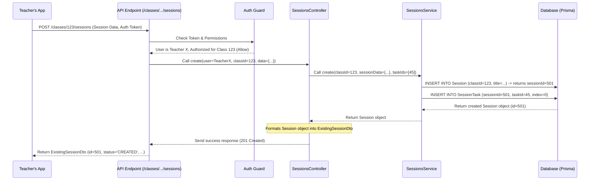

# Chapter 3: Sessions

In [Chapter 2: Entity Modules (Classes, Tasks, Users)](02_entity_modules__classes__tasks__users_.md), we saw how the `api` project organizes code around core concepts like `Classes` and `Tasks`. We know a `Class` is like a course, and `Tasks` are the assignments or activities within it. But how do we actually *run* an activity for students at a specific time? That's where **Sessions** come in!

## Motivation: Starting the Lab!

Imagine you're a teacher using this platform. You've created your "Biology 101" `Class` and added a "Microscope Usage" `Task`. Now, you want your students to actually *do* this task during today's lab period. You need a way to:

1.  Start the "Microscope Usage" activity specifically for the "Biology 101" class *right now*.
2.  Allow students (maybe even some guests who aren't formally enrolled) to join this specific activity instance.
3.  Collect the work students submit during this particular lab period.
4.  Control when the activity starts, maybe pause it, and eventually finish it.

This "live instance" of an activity is what we call a **Session**.

## What is a Session?

Think of a `Session` like scheduling and opening a specific lab room for a particular experiment.

*   **It's a Live Instance:** A `Session` represents a specific, active learning activity or assignment instance happening within a particular `Class`. While the `Task` ("Microscope Usage") is the *template* for the activity, the `Session` is the *actual event* of running that activity (e.g., "Biology 101 - Microscope Lab - Oct 26th, 2 PM").
*   **Groups Tasks:** A single `Session` can include one or more `Tasks`. Maybe the lab involves both "Microscope Setup" and "Slide Observation" tasks. The Session bundles these together for the students.
*   **Has a Lifecycle:** A Session isn't always active. It goes through stages:
    *   `CREATED`: The teacher has set it up, but it hasn't started yet.
    *   `ONGOING`: The session is active, and students can participate.
    *   `PAUSED`: The teacher has temporarily halted the session.
    *   `FINISHED`: The session is over, and participation usually stops.
*   **Can Allow Anonymous Students:** Remember from [Chapter 1: User & Student Identity](01_user___student_identity_.md) that students can be `Authenticated` (linked to a Class) or `Anonymous` (temporary)? Sessions can be configured to allow these `Anonymous` students to join just for that specific session instance, without needing to be formally enrolled in the `Class`. This is great for workshops or guest participants.
*   **Collects Solutions:** When students submit their work (like answers or code), they submit it *within the context of a specific Session*. This allows teachers to see all the submissions for that particular activity instance. We'll explore this more in [Chapter 5: Solutions & Analysis](05_solutions___analysis_.md).

## Use Case: Creating a Session

Let's go back to our teacher who wants to start the "Microscope Usage" lab for "Biology 101". They need to create a new `Session`.

Like other entities, Sessions have their own module (`sessions/`) with a controller (`sessions.controller.ts`) and service (`sessions.service.ts`).

Here's how the teacher (an authenticated `User`) might trigger this via the API:

1.  **Request:** Send a `POST` request to `/classes/123/sessions` (where `123` is the ID of the "Biology 101" `Class`).
2.  **Data:** Include details like the Session title ("Microscope Lab Oct 26"), which Tasks to include (e.g., the ID of the "Microscope Usage" task), and whether anonymous students are allowed. This data is often structured using a [Data Transfer Object (DTO)](06_data_transfer_objects__dtos_.md) like `CreateSessionDto`.

```typescript
// Example Input (Simplified CreateSessionDto)
{
  "title": "Microscope Lab Oct 26",
  "description": "Practice using the compound microscope.",
  "isAnonymous": false, // Only allow students from this Class
  "taskIds": [ 45 ] // ID of the "Microscope Usage" Task
}
```

3.  **Controller Action:** The `SessionsController` receives this request.

```typescript
// sessions/sessions.controller.ts (Simplified create method)
import { Body, Controller, Param, Post } from "@nestjs/common";
import { AuthenticatedUser } from "../authentication/authenticated-user.decorator";
// ... other imports ...

@Controller("classes/:classId/sessions")
export class SessionsController {
  constructor(private readonly sessionsService: SessionsService) {}

  @Post() // Handles POST requests to /classes/:classId/sessions
  async create(
    @AuthenticatedUser() user: User, // Get the logged-in teacher
    @Param("classId") classId: number, // Get classId from URL
    @Body() createSessionDto: CreateSessionDto, // Get data from request
  ): Promise<ExistingSessionDto> {
    // First, check if the teacher is allowed to create a session
    // for this class (using AuthorizationService - see Chapter 4)
    // ... authorization check omitted for brevity ...

    // Call the service to actually create the session
    const { taskIds, ...dto } = createSessionDto;
    const session = await this.sessionsService.create(classId, dto, taskIds);

    // Format and return the newly created session details
    return ExistingSessionDto.fromQueryResult(session);
  }
  // ... other methods like start, pause, finish, findOne ...
}
```
*Explanation:* This controller method uses decorators (`@Post`, `@AuthenticatedUser`, `@Param`, `@Body`) to handle the incoming request, extract necessary information (who is making the request, which class it's for, and the session details), and then calls the `sessionsService.create` method to do the actual work.

4.  **Service Logic:** The `SessionsService` takes the details and creates the session in the database.

```typescript
// sessions/sessions.service.ts (Simplified create method)
import { Injectable } from "@nestjs/common";
import { PrismaService } from "src/prisma/prisma.service";
// ... other imports ...

@Injectable()
export class SessionsService {
  constructor(private readonly prisma: PrismaService) {}

  async create(classId: number, sessionData: any, taskIds: number[]) {
    // Use Prisma (our database tool) to create a new Session record
    const newSession = await this.prisma.session.create({
      data: {
        // Spread the basic session data (title, description, etc.)
        ...sessionData,
        // Link it to the correct Class
        class: { connect: { id: classId } },
        // Link the specified Tasks to this Session
        tasks: {
          createMany: { // Create links in the SessionTask join table
            data: taskIds.map((taskId, index) => ({ taskId, index })),
          },
        },
      },
      // Include related data (like linked tasks) in the result
      include: { tasks: true /* ... other includes ... */ },
    });
    return newSession;
  }
  // ... other methods like findByIdAndClassOrThrow, changeStatus ...
}
```
*Explanation:* The service uses `PrismaService` to interact with the database. It creates a new `session` record, ensuring it's connected to the correct `classId`. It also creates entries in a linking table (`SessionTask`) to associate the chosen `Tasks` with this new `Session`, preserving their order using `index`.

5.  **Response:** The API sends back details of the newly created session (usually as an `ExistingSessionDto`).

```typescript
// Example Output (Simplified ExistingSessionDto)
{
  "id": 501, // The unique ID of the new session
  "createdAt": "2023-10-26T14:00:00.000Z",
  "title": "Microscope Lab Oct 26",
  "description": "Practice using the compound microscope.",
  "isAnonymous": false,
  "status": "CREATED", // Initial status
  "tasks": [ 45 ] // List of included task IDs
}
```
*Explanation:* The teacher's application receives this confirmation, knowing the session is ready (but not yet started). The teacher could then use other API calls (like `POST /classes/123/sessions/501/start`) to change the session `status` to `ONGOING`.

## Under the Hood: How Session Creation Works

Let's trace the journey of that "create session" request:

1.  **Request:** The Teacher's app sends `POST /classes/123/sessions` with session data and the teacher's [Authentication Token](01_user___student_identity_.md).
2.  **Guard Check:** An [Authentication & Authorization](04_authentication___authorization_.md) guard intercepts the request. It uses the token to identify the `User` (the teacher) and checks if this teacher has permission to create sessions for `Class` 123. Let's assume they do.
3.  **Controller:** The request reaches the `create` method in `SessionsController`.
4.  **Service Call:** The controller calls `sessionsService.create()`, passing the `classId` (123), the session details (title, etc.), and the `taskIds` ([45]).
5.  **Database Interaction:** The `SessionsService` uses `PrismaService` to execute database commands:
    *   `INSERT` a new row into the `Session` table with the details, linking to `classId` 123. Get the new `sessionId` (e.g., 501).
    *   `INSERT` rows into the `SessionTask` table to link `sessionId` 501 with `taskId` 45.
6.  **Service Response:** The `SessionsService` returns the newly created session data (including its ID 501 and linked tasks) to the controller.
7.  **Controller Response:** The `SessionsController` formats the data into an `ExistingSessionDto` and sends it back to the teacher's app with a success status (like `201 Created`).

Here’s a simplified diagram:



## Conclusion

You've learned about **Sessions**, the core concept for running live learning activities in the `api` project.

*   A Session is a **live instance** of one or more `Tasks` within a specific `Class`.
*   It acts like starting a specific lab or assignment period.
*   Sessions have a **lifecycle** (`CREATED`, `ONGOING`, `PAUSED`, `FINISHED`).
*   They can be configured for **anonymous participation**.
*   Student **solutions are submitted** to specific Sessions.
*   Creating a session involves the `SessionsController` handling the request and the `SessionsService` interacting with the database to create the `Session` record and link the relevant `Tasks`.

Now that we understand how users, classes, tasks, and sessions work, we need to make sure only the *right* people can perform actions like creating sessions or viewing student work. That brings us to the crucial topic of security.

Next, let's explore how the system manages permissions: [Chapter 4: Authentication & Authorization](04_authentication___authorization_.md).

---

Generated by [AI Codebase Knowledge Builder](https://github.com/The-Pocket/Tutorial-Codebase-Knowledge)