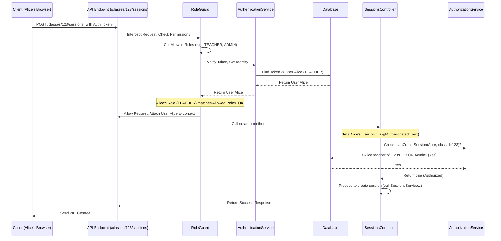

# Chapter 4: Authentication & Authorization

In the previous chapters, we learned about the different people interacting with our system ([Chapter 1: User & Student Identity](01_user___student_identity_.md)), how the code is organized around key concepts like `Classes` and `Tasks` ([Chapter 2: Entity Modules (Classes, Tasks, Users)](02_entity_modules__classes__tasks__users_.md)), and how we run live activities using [Chapter 3: Sessions](03_sessions_.md).

Now, we need to add a layer of security. How do we make sure only teachers can create classes? How do we prevent students from seeing each other's grades (or deleting the whole system!)? This chapter introduces **Authentication** and **Authorization** – the system's digital security guards.

## Motivation: Building Security

Imagine our API is like a secure office building.

1.  **Authentication:** When someone arrives, the security guard at the front desk needs to check their ID badge to verify *who they are*. Are they an employee (like a Teacher or Admin) or a visitor (like a Student)? This is **Authentication**.
2.  **Authorization:** Once inside, the ID badge might only grant access to certain floors or rooms. An employee might be able to enter most offices, while a visitor might only be allowed in the lobby or specific meeting rooms. The system checks *what they are allowed to do* based on their verified identity. This is **Authorization**.

Our API needs both:
*   It needs to reliably know *who* is making a request (Authentication).
*   It needs to check if that person has *permission* to perform the requested action (Authorization).

This is crucial for protecting data, ensuring privacy, and maintaining the system's integrity.

## Key Concepts: ID Badges and Access Rules

Let's break down these two ideas:

### 1. Authentication: "Who Are You?"

*   **What it is:** The process of verifying the identity of a user or student trying to access the system.
*   **How it works:** As we saw in [Chapter 1: User & Student Identity](01_user___student_identity_.md), when a User logs in (via OIDC) or a Student joins (authentically or anonymously), the system gives them a unique, secret **Authentication Token**.
*   **Analogy:** This token acts like a temporary digital ID badge. For every subsequent request to the API, the client (e.g., the web browser) includes this token.
*   **The Check:** The API receives the request, looks at the token, and verifies it (Is it valid? Is it expired?). If valid, the API now knows exactly who is making the request (e.g., "This is Teacher Alice" or "This is Student Bob from Class 101").
*   **Key Component:** The `AuthenticationService` (`authentication/authentication.service.ts`) is primarily responsible for issuing these tokens (during login) and verifying them when requests come in.

```typescript
// authentication/authentication.service.ts (Simplified concept)
class AuthenticationService {
  // ... login methods ...

  // Checks a token and returns the User or Student identity
  async findUserByAuthTokenOrThrow(token: string): Promise<User | Student> {
    // 1. Look up token in database
    // 2. Check if expired
    // 3. Get linked User or Student details
    // 4. Return identity (e.g., User object or Student object)
    // ... implementation details ...
  }

  // Helper to know if the identity is a Student
  isStudent(user: User | Student): user is Student {
    // ... check properties ...
  }
}
```
*Explanation:* This service acts like the security desk, validating the ID badge (token) presented by the requester.

### 2. Authorization: "What Can You Do?"

*   **What it is:** Once we know *who* someone is (Authentication), we need to determine if they have permission to do what they're asking to do.
*   **How it works:** Authorization uses the verified identity (especially the User's `type` like `ADMIN` or `TEACHER`, or the fact that they are a `STUDENT`) to check against access rules defined for specific actions or data.
*   **Analogy:** Based on your ID badge (e.g., "Teacher"), the system checks if you're allowed to open a specific door (e.g., the "Create Class" door or the "View Admin Settings" door).
*   **Roles:** We often use **Roles** (like `ADMIN`, `TEACHER`, `STUDENT`, or even `UNAUTHENTICATED` for public access) to define these permissions. An action might require the `ADMIN` role, while another might allow both `TEACHER` and `ADMIN`.
*   **Key Components:**
    *   **`RoleGuard`** (`authentication/role.guard.ts`): This acts like an automatic door checker. It intercepts incoming requests *after* authentication, checks the required roles for the requested action against the user's role, and either allows the request to proceed or denies it.
    *   **`AuthorizationService`** (`authorization/authorization.service.ts`): For more fine-grained checks (e.g., "Can *this specific* teacher manage *this specific* class?"), the code inside a controller or service might use this service to perform additional permission checks.

```typescript
// authentication/role.decorator.ts (Simplified concept)
// Decorator used to specify allowed roles for an endpoint
const Roles = (allowed: Role[]) => SetMetadata('allowedRoles', allowed);

// Example Usage in a Controller:
@Controller('admin')
export class AdminController {
  @Get('settings')
  @Roles([UserType.ADMIN]) // Only Admins can access this!
  getSettings() {
    // ... logic for getting admin settings ...
  }
}
```
*Explanation:* The `@Roles` decorator marks the `getSettings` endpoint, telling the `RoleGuard` that only users with the `ADMIN` role should be allowed access.

## Use Case: Teacher Creates a Session

Let's revisit the use case from [Chapter 3: Sessions](03_sessions_.md). A Teacher (let's call her Alice) wants to create a new `Session` for her "Biology 101" class (ID `123`).

1.  **Request:** Alice's browser sends a `POST` request to `/classes/123/sessions` with the session details and her **Authentication Token**.
2.  **Authentication Check:** The API receives the request. The `RoleGuard` intercepts it.
3.  **Token Verification:** The `RoleGuard` extracts the token and asks the `AuthenticationService` to verify it.
4.  **Identity Found:** The `AuthenticationService` checks the token against the database, confirms it's valid and belongs to Alice (who is a `TEACHER`), and returns Alice's `User` object.
5.  **Authorization Check (Role):** The `RoleGuard` looks at the rules defined for the "create session" endpoint. Let's say it requires either a `TEACHER` or `ADMIN` role. Since Alice is a `TEACHER`, this basic role check passes.
6.  **Authorization Check (Specific Permission):** *Inside* the `SessionsController`'s `create` method, before actually creating the session, the code might make an additional check using the `AuthorizationService`:

    ```typescript
    // sessions/sessions.controller.ts (Simplified snippet)
    async create(
      @AuthenticatedUser() user: User, // Alice's User object (thanks to RoleGuard)
      @Param("classId") classId: number, // Class ID 123
      // ... other params ...
    ) {
      // Explicit permission check: Can THIS user create sessions for THIS class?
      const canCreate = await this.authorizationService.canCreateSession(user, classId);
      if (!canCreate) {
        throw new ForbiddenException(); // Stop if not allowed!
      }

      // ... If allowed, proceed to call sessionsService.create() ...
    }
    ```
    *Explanation:* The `@AuthenticatedUser()` decorator easily provides Alice's `User` object (which the `RoleGuard` attached earlier). The code then calls `authorizationService.canCreateSession` to verify if Alice (the specific user) is indeed the teacher of class `123` (or an Admin).

7.  **Permission Granted:** The `AuthorizationService` checks if Alice (`user.id`) is the `teacherId` associated with `Class` 123 in the database (or if she's an Admin). Let's say she is. It returns `true`.
8.  **Action Proceeds:** The `ForbiddenException` is not thrown, and the controller proceeds to call the `sessionsService.create` method to actually create the session.

If a Student had tried to make the same request, the `RoleGuard` (Step 5) would likely have stopped them immediately because they don't have the `TEACHER` or `ADMIN` role. If another Teacher (Bob) tried to create a session for Alice's class, the `AuthorizationService` check (Step 6/7) would fail because Bob is not the teacher of class `123`.

## Under the Hood: How the Guards Work

Let's visualize the flow for Alice's successful request:



**Key Code Components:**

1.  **Defining Allowed Roles:** Roles are attached to controllers or specific methods using decorators.

    ```typescript
    // authentication/role.decorator.ts
    // Defines the metadata key used to store allowed roles
    export const ALLOWED_ROLES = "allowedRoles";
    // Defines possible roles (User types + special roles)
    export type Role = UserType | NonUserRoles;
    // The decorator function itself
    export const Roles = (allowedUserTypes: Role[]): CustomDecorator<string> =>
      SetMetadata(ALLOWED_ROLES, allowedUserTypes);

    // Example in sessions.controller.ts might implicitly use defaults
    // or explicitly set roles if needed for specific methods.
    // If no @Roles() is present, RoleGuard uses default roles (Admin/Teacher).
    ```
    *Explanation:* This code provides the `@Roles(...)` decorator used to mark endpoints with specific permissions.

2.  **The Role Guard:** This guard implements the `CanActivate` interface from NestJS. Its `canActivate` method is automatically called before the controller handler.

    ```typescript
    // authentication/role.guard.ts (Simplified canActivate)
    @Injectable()
    export class RoleGuard implements CanActivate {
      constructor(
        private readonly authenticationService: AuthenticationService,
        private readonly reflector: Reflector, // Tool to read metadata like @Roles
      ) {}

      async canActivate(context: ExecutionContext): Promise<boolean> {
        // Get roles defined by @Roles() decorator, or use defaults
        const allowedRoles = this.reflector.getAllAndOverride<Role[]>(...) ?? this.defaultAllowedRoles;

        // Skip checks if endpoint is public (@Public() -> allows UNAUTHENTICATED)
        if (allowedRoles.includes(NonUserRoles.UNAUTHENTICATED)) return true;

        try {
          // Get token from request headers/context
          const token = getTokenFromExecutionContext(context);
          // Verify token and get User or Student identity
          const userOrStudent = await this.authenticationService.findUserByAuthTokenOrThrow(token);

          if (this.authenticationService.isStudent(userOrStudent)) {
            // Check if STUDENT role is allowed
            if (!allowedRoles.includes(NonUserRoles.STUDENT)) throw new ForbiddenException();
            // Attach student identity to request for later use (@AuthenticatedStudent)
            AuthenticationService.setKeyOnContext(context, studentRequestKey, userOrStudent);
          } else { // It's a User (Admin/Teacher)
            // Check if User's type (role) is allowed
            if (!allowedRoles.includes(userOrStudent.type)) throw new ForbiddenException();
            // Attach user identity to request for later use (@AuthenticatedUser)
            AuthenticationService.setKeyOnContext(context, userRequestKey, userOrStudent);
          }
          return true; // Allowed!
        } catch (e) {
          // Handle errors like invalid token or forbidden access
          if (e instanceof ForbiddenException) throw e;
          throw new UnauthorizedException(); // Not authenticated or other error
        }
      }
    }
    ```
    *Explanation:* The guard first checks the required roles for the endpoint. It then verifies the token using `AuthenticationService`. Based on whether the identity is a User or Student, it checks if their role is in the allowed list. If allowed, it attaches the identity to the request context and returns `true`; otherwise, it throws an error.

3.  **Fine-grained Checks with AuthorizationService:**

    ```typescript
    // authorization/authorization.service.ts (Simplified example method)
    @Injectable()
    export class AuthorizationService {
      constructor(private readonly prisma: PrismaService) {}

      async canCreateSession(user: User, classId: number): Promise<boolean> {
        // Admins can always do this
        if (user.type === UserType.ADMIN) {
          return true;
        }
        // Check if the user is the teacher of the specific class
        const klass = await this.prisma.class.findUnique({
          where: { id: classId, teacherId: user.id }, // Match class AND teacher
          select: { id: true }, // Just need to know if it exists
        });
        // Return true only if they are the teacher (or Admin checked above)
        return klass !== null;
      }
      // ... many other methods like canViewClass, canDeleteTask, etc. ...
    }
    ```
    *Explanation:* This service provides specific permission-checking logic. The `canCreateSession` method checks if the given `User` is either an `ADMIN` or the designated `teacherId` for the given `classId` by querying the database. Controllers call these methods for checks beyond basic role validation.

## Conclusion

You've now learned about the critical concepts of **Authentication** and **Authorization** in the `api` project!

*   **Authentication** is about verifying *who* a user or student is, typically using **Tokens** managed by the `AuthenticationService`.
*   **Authorization** is about checking *what* an authenticated user/student is allowed to do, based on their **Roles** and specific permissions.
*   The **`RoleGuard`** automatically handles basic role checks for incoming requests based on decorators like `@Roles`.
*   The **`AuthorizationService`** provides methods for more detailed, context-specific permission checks (e.g., "Is this user the owner of this resource?").
*   Decorators like `@AuthenticatedUser` and `@AuthenticatedStudent` make it easy to access the verified identity within your code.

This security layer ensures that users and students can only access the data and perform the actions appropriate for their role and context.

Now that we understand how users, entities, sessions, and security work, let's dive into how students interact with tasks by submitting their work.

Next up: [Chapter 5: Solutions & Analysis](05_solutions___analysis_.md)

---

Generated by [AI Codebase Knowledge Builder](https://github.com/The-Pocket/Tutorial-Codebase-Knowledge)