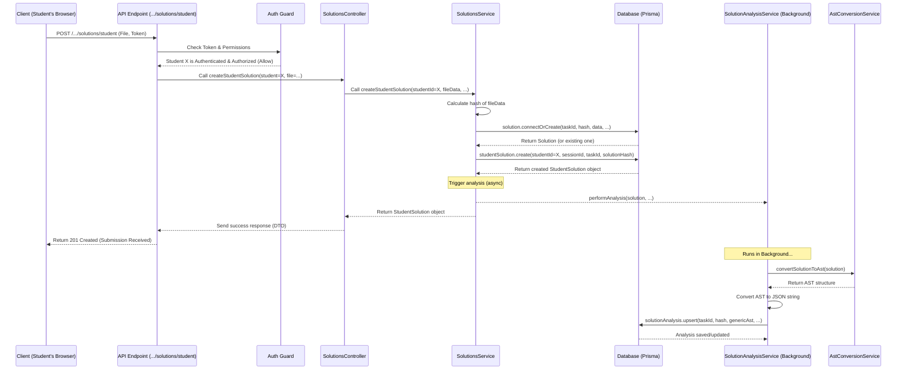

# Chapter 5: Solutions & Analysis

In [Chapter 4: Authentication & Authorization](04_authentication___authorization_.md), we learned how the system ensures only the right people can access the right things. Now, let's see what happens when students actually *do* the work assigned to them in a [Session](03_sessions_.md) – how are their submissions handled? This chapter focuses on **Solutions** (student submissions) and how the system **Analyzes** them.

## Motivation: Collecting and Understanding Homework

Imagine you're a teacher who assigned a Scratch programming task. Students build their projects and need to turn them in. In the physical world, you'd collect their project files (or maybe printouts). In our digital system, we need a way to:

1.  **Collect Submissions:** Receive the project file (e.g., a `.sb3` Scratch file) submitted by a student for a specific task within a session.
2.  **Store Efficiently:** Save these submissions without filling up storage with identical files if multiple students submit the exact same project (or if one student submits the same file multiple times).
3.  **Understand the Content:** Go beyond just storing the file. We need to understand the *structure* of the submitted project (e.g., what blocks were used, how they are connected). This is like a teacher reading the homework to understand the student's approach, not just collecting the paper.

This process of collecting the submission and understanding its structure is handled by the **Solutions & Analysis** part of our API.

## Key Concepts: Submissions and Grading

Let's break down how the system manages this:

### 1. Solutions: The Submitted Work

*   **Analogy:** The actual homework paper or digital file a student turns in.
*   **What it is:** A `Solution` represents the *content* of a student's submission for a specific `Task`. This is usually the file itself (like the Scratch project).
*   **Unique Identification (Hashing):** When a file is submitted, the system calculates a unique digital fingerprint called a **hash** based on the file's content. Think of it like a super-specific checksum.
    *   **Why? Deduplication:** If two students submit the exact same file, the hashes will be identical. The system can store the actual file data *once* under that hash and simply link multiple submissions to it. This saves space and is efficient.
*   **Storage:** The `Solution` record in the database stores this hash and the actual file data (often as binary data).

```typescript
// Simplified conceptual view of Solution data
type Solution = {
  taskId: number;   // Which task is this a solution for?
  hash: Buffer;     // The unique fingerprint (binary data)
  mimeType: string; // What type of file is it (e.g., 'application/x-scratch-project')
  data: Buffer;     // The actual file content (binary data)
  // ... plus maybe tracking for analysis attempts
};
```
*Explanation:* This structure holds the core file content (`data`), its type (`mimeType`), which task it belongs to (`taskId`), and the unique `hash`.

*   **StudentSolution:** There's also a related concept, often called `StudentSolution`. This links a specific `Student` to a specific `Solution` (via its hash) within a specific `Session`. It represents the *act* of a particular student submitting that work at that time.

```typescript
// Simplified conceptual view of StudentSolution data
type StudentSolution = {
  id: number;         // Unique ID for this specific submission event
  studentId: number;  // Who submitted it?
  sessionId: number;  // During which session?
  taskId: number;     // For which task?
  solutionHash: Buffer; // Which solution content did they submit? (Links to Solution.hash)
  createdAt: Date;    // When was it submitted?
  isReference: boolean; // Is this marked as a good example? (Teacher use)
  // ... potentially links to test results
};
```
*Explanation:* This connects the `Student`, `Session`, `Task`, and the actual `Solution` content, representing a specific submission event.

### 2. Analysis & Abstract Syntax Trees (AST): Understanding the Work

*   **Analogy:** The teacher reading the homework and maybe breaking down the student's logic or sentence structure.
*   **What it is:** Simply storing the file isn't enough. We want to understand its structure for comparison, feedback, or finding common patterns. **Analysis** is the process of converting the submitted `Solution` (the file) into a standardized, structured format.
*   **Abstract Syntax Tree (AST):** This standardized format is often an **Abstract Syntax Tree**. Don't worry too much about the name! Think of it as a detailed, structured outline or map of the project's code or blocks. It represents the logical structure, ignoring things like comments or exact layout. For a Scratch project, the AST might describe the sprites, the scripts in each sprite, and the blocks within each script in a consistent way.
*   **Why?** Having a standard AST allows the system to:
    *   Compare different solutions structurally.
    *   Potentially identify common mistakes or successful patterns.
    *   Provide automated feedback in the future.
*   **Storage:** The result of the analysis (the AST, often stored as a structured text format like JSON) is saved in a `SolutionAnalysis` record, linked to the original `Solution` via its hash and task ID.

```typescript
// Simplified conceptual view of SolutionAnalysis data
type SolutionAnalysis = {
  taskId: number;       // Links to the Task
  solutionHash: Buffer; // Links to the Solution content
  astVersion: string;   // Which version of AST format? (e.g., 'v1')
  genericAst: string;   // The AST itself (e.g., as a JSON string)
  // ... maybe analysis status
};
```
*Explanation:* This stores the standardized structural representation (`genericAst`) of a specific `Solution` content (`solutionHash`) for a given `Task`, along with the version of the analysis format used.

### 3. Background Processing: Grading Takes Time

*   **Analogy:** A teacher collects homework at the end of class but grades it later that evening.
*   **How it works:** Analyzing a complex project file to create an AST can take time (seconds, or even longer). If the API waited for the analysis to complete before responding to the student's submission, the user interface might feel slow and unresponsive.
*   **Solution:** The analysis often happens **in the background**. When a student submits a solution:
    1.  The API quickly saves the `Solution` and `StudentSolution`.
    2.  It immediately sends a response back to the student confirming the submission was received.
    3.  It then schedules the analysis task to be performed separately, possibly by a different process or using a job queue.
*   **Key Component:** The `SolutionAnalysisService` (`solutions/solution-analysis.service.ts`) is responsible for performing this conversion, potentially calling an `AstConversionService` (`ast/ast-conversion.service.ts`). The `SolutionsService` might trigger this analysis but not wait for it to finish.

## Use Case: Student Submits a Scratch Project

Let's follow a student submitting their `.sb3` file for "Task 45" during "Session 501" in "Class 123".

1.  **Upload:** The student uses the web application to select their file and click "Submit". The application sends a `POST` request to an endpoint like `/classes/123/sessions/501/task/45/solutions/student`. This request includes the file itself and the student's [Authentication Token](01_user___student_identity_.md).

2.  **Controller Handles Request:** The request reaches the `SolutionsController`. The `createStudentSolution` method handles it.

    ```typescript
    // solutions/solutions.controller.ts (Simplified createStudentSolution)
    import { Post, Param, Body, UploadedFile, UseInterceptors } from "@nestjs/common";
    import { FileInterceptor } from "@nestjs/platform-express";
    // ... other imports ...

    @Controller("classes/:classId/sessions/:sessionId/task/:taskId/solutions")
    export class SolutionsController {
      constructor(private readonly solutionsService: SolutionsService) {}

      @Post("student") // Handle POST requests for student submissions
      @StudentOnly() // Ensure only authenticated students can call this
      @UseInterceptors(FileInterceptor("file")) // Handle file upload named "file"
      async createStudentSolution(
        @AuthenticatedStudent() student: Student, // Get student identity
        @Param("sessionId") sessionId: number,
        @Param("taskId") taskId: number,
        @Body() createSolutionDto: CreateSolutionDto, // Other form data if any
        @UploadedFile() file: Express.Multer.File, // The uploaded file!
      ): Promise<ExistingStudentSolutionDto> {
        // Pass details to the service to handle creation and analysis trigger
        const studentSolution = await this.solutionsService.createStudentSolution(
          { /* DTO data */ sessionId, taskId, studentId: student.id },
          file.mimetype, // e.g., 'application/x-scratch-project'
          file.buffer,   // The raw file content
        );
        // Return confirmation DTO
        return ExistingStudentSolutionDto.fromQueryResult(studentSolution);
      }
    }
    ```
    *Explanation:* This controller method uses decorators to get the student's identity (`@AuthenticatedStudent`), session/task IDs (`@Param`), other form data (`@Body`), and crucially, the uploaded file (`@UploadedFile`). It then calls the `solutionsService` to process the submission.

3.  **Service Processes Submission:** The `SolutionsService` takes the file data and details.

    ```typescript
    // solutions/solutions.service.ts (Simplified createStudentSolution)
    import { Injectable } from "@nestjs/common";
    import { PrismaService } from "src/prisma/prisma.service";
    import { SolutionAnalysisService } from "./solution-analysis.service";
    import { TasksService } from "../tasks/tasks.service"; // Needed for hash calculation

    @Injectable()
    export class SolutionsService {
      constructor(
        private readonly prisma: PrismaService,
        private readonly tasksService: TasksService, // To compute hash
        private readonly analysisService: SolutionAnalysisService, // To trigger analysis
      ) {}

      async createStudentSolution(
        studentSolutionInput: any, // Contains sessionId, taskId, studentId etc.
        mimeType: string,
        data: Buffer, // The file content
      ): Promise<StudentSolutionWithoutData> {
        // 1. Calculate the unique hash for the file content
        const hash = this.tasksService.computeSolutionHash(data);

        // 2. Save/Link the core Solution (using hash to avoid duplicates)
        //    'connectOrCreate' tries to link to existing Solution by hash,
        //    or creates it if it's the first time this content is seen.
        const solutionConnectOrCreate = {
          create: { taskId: studentSolutionInput.taskId, hash, mimeType, data },
          where: { taskId_hash: { taskId: studentSolutionInput.taskId, hash } },
        };

        // 3. Create the StudentSolution record linking student, session, task, solution
        const studentSolution = await this.prisma.studentSolution.create({
          data: {
            student: { connect: { id: studentSolutionInput.studentId } },
            session: { connect: { id: studentSolutionInput.sessionId } },
            task: { connect: { id: studentSolutionInput.taskId } },
            solution: { connectOrCreate: solutionConnectOrCreate },
            // ... other fields like tests ...
          },
          include: { solution: true /* omit data */, tests: true }, // Include related data needed for response DTO
        });

        // 4. Trigger the analysis (DO NOT 'await' this - run in background)
        this.analysisService.performAnalysis(studentSolution.solution, /* latest AST version */);

        // 5. Return the created StudentSolution details (for the response DTO)
        return studentSolution;
      }
    }
    ```
    *Explanation:* The service first calculates the `hash` of the file content. It then uses `connectOrCreate` to efficiently store the `Solution` data (only if the hash+taskId combo is new). It creates the `StudentSolution` record linking everything together. Crucially, it calls `analysisService.performAnalysis` but *doesn't* wait for it to finish (`await` is omitted intentionally or handled via a queue). Finally, it returns the details of the created `StudentSolution`.

4.  **Analysis Service (Background Task):** The `SolutionAnalysisService` gets triggered.

    ```typescript
    // solutions/solution-analysis.service.ts (Simplified performAnalysis)
    import { Injectable } from "@nestjs/common";
    import { AstConversionService } from "src/ast/ast-conversion.service"; // The converter
    import { PrismaService } from "src/prisma/prisma.service";

    @Injectable()
    export class SolutionAnalysisService {
      constructor(
        private readonly prisma: PrismaService,
        private readonly astConversionService: AstConversionService,
      ) {}

      async performAnalysis(solution: Solution, astVersion: AstVersion): Promise<SolutionAnalysis> {
        try {
          // 1. Convert the solution data to an AST structure
          const ast = await this.astConversionService.convertSolutionToAst(
            /* task details maybe needed */,
            solution,
          );

          // 2. Convert AST object to storable format (e.g., JSON string)
          const genericAst = JSON.stringify(ast);

          // 3. Save the analysis result (or update if retrying)
          return this.prisma.solutionAnalysis.upsert({
            where: { taskId_solutionHash: { taskId: solution.taskId, solutionHash: solution.hash } },
            create: { taskId: solution.taskId, solutionHash: solution.hash, genericAst, astVersion },
            update: { genericAst, astVersion }, // Update if exists (e.g., re-analysis)
          });
        } catch (e) {
          // Handle errors (e.g., conversion failed)
          // Increment a failure counter on the Solution to avoid infinite retries
          await this.prisma.solution.update({
             where: { taskId_hash: { taskId: solution.taskId, hash: solution.hash } },
             data: { failedAnalyses: { increment: 1 } },
          });
          // Log the error, maybe schedule retry if count < max
          console.error(`Analysis failed for task ${solution.taskId}, hash ${solution.hash}:`, e);
          throw e; // Re-throw to indicate failure
        }
      }
    }
    ```
    *Explanation:* This service gets the `Solution` data. It calls the `AstConversionService` to do the heavy lifting of creating the AST structure. It then saves this structured `genericAst` into the `SolutionAnalysis` table in the database, linked to the original solution by its `taskId` and `hash`. It includes error handling and uses `upsert` to handle potential retries or updates gracefully.

5.  **Response:** Back in step 3, the `SolutionsService` already returned the `StudentSolution` data to the `SolutionsController`, which formats it into an `ExistingStudentSolutionDto` and sends it back to the student's browser almost immediately, confirming the submission was received, even while the analysis might still be running in the background.

## Under the Hood: Submission and Background Analysis

Let's trace the flow:

1.  **Student Submits:** Browser sends `POST` request with file and token.
2.  **Guard:** [Authentication & Authorization](04_authentication___authorization_.md) guard checks token, verifies student identity and permissions for the session/task.
3.  **Controller:** `SolutionsController.createStudentSolution` receives the file and metadata.
4.  **Service (Part 1 - Submission):** `SolutionsService.createStudentSolution` calculates hash, uses `prisma.solution.connectOrCreate` to save/link the unique file content, and `prisma.studentSolution.create` to record the student's specific submission event.
5.  **Service (Part 2 - Trigger Analysis):** `SolutionsService` calls `solutionAnalysisService.performAnalysis` (without `await`).
6.  **Response:** `SolutionsService` returns `StudentSolution` data to Controller, which sends confirmation DTO back to the browser.
7.  **Analysis Service (Later):** `SolutionAnalysisService.performAnalysis` runs (maybe immediately after, maybe via a queue). It calls `AstConversionService`, gets the AST, and saves it to the `SolutionAnalysis` table in the database.



This asynchronous approach keeps the submission process fast for the user while ensuring the valuable analysis still happens.

## Conclusion

You've learned how the `api` project handles student work:

*   Submissions are stored as **Solutions**, identified by a unique **hash** of their content to save space.
*   A `StudentSolution` record links a specific student, session, task, and the submitted Solution content.
*   The system **Analyzes** solutions, converting them into a standard **Abstract Syntax Tree (AST)** structure to understand their content.
*   This analysis often happens in the **background** using the `SolutionAnalysisService` to keep the API responsive during submission.

Understanding how submissions are stored and analyzed is key to seeing how student progress can be tracked and potentially compared. But how do we ensure the data moving between the client, controller, and service has the right shape?

Next, we'll look at the "forms" used to structure this data: [Chapter 6: Data Transfer Objects (DTOs)](06_data_transfer_objects__dtos_.md).

---

Generated by [AI Codebase Knowledge Builder](https://github.com/The-Pocket/Tutorial-Codebase-Knowledge)