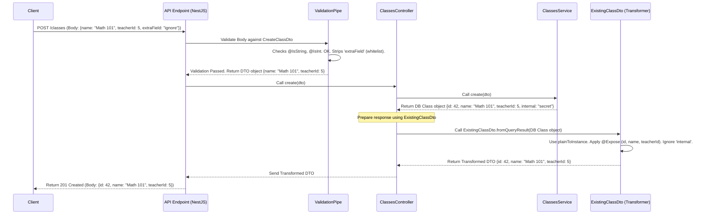

# Chapter 6: Data Transfer Objects (DTOs)

In [Chapter 5: Solutions & Analysis](05_solutions___analysis_.md), we saw how students submit their work (`Solutions`) and how the system processes it (`Analysis`). We saw data flowing from the student's browser, through the API, to the database, and potentially back again. But how do we make sure this data is structured correctly and safely at each step? How do we define the exact "shape" of the data expected in a request, or the data returned in a response?

That's where **Data Transfer Objects (DTOs)** come in. They are essential for creating clear, reliable, and secure APIs.

## Motivation: Standard Forms for Data

Imagine ordering food online. The website presents you with a specific form: you need to enter the item name, quantity, maybe some options (like "extra cheese"), and your delivery address. You can't just send a random note saying "Pizza please!". The form ensures the restaurant gets exactly the information it needs, in the format it expects.

Similarly, when the restaurant confirms your order, they send back a receipt. This receipt has a standard format: order number, items, total price, estimated delivery time. It doesn't include internal details like the cook's name or the inventory level of pepperoni.

DTOs in our API act like these standardized forms and receipts for data:

1.  **Incoming Data (Requests):** Like the online order form, DTOs define precisely what information the API expects when receiving data (e.g., when creating a new class, submitting a solution). They specify the required fields, their types (e.g., `string`, `number`, `boolean`), and often validation rules (e.g., "name cannot be empty", "email must be a valid email address").
2.  **Outgoing Data (Responses):** Like the order receipt, DTOs define the structure of data the API sends back. This allows us to control exactly what information is exposed, potentially hiding sensitive internal details (like database IDs or passwords) and formatting values nicely (like dates or calculated fields).

Without DTOs, our API endpoints would be like accepting random notes instead of structured forms – messy, error-prone, and potentially insecure.

## Key Concepts: Shaping, Validating, and Transforming

Let's break down the main jobs of DTOs:

### 1. Defining the "Shape"

*   **What:** A DTO is typically a TypeScript `class` that defines the fields (properties) data should have.
*   **Example:** A DTO for creating a user might have `name`, `email`, and `type` properties.
*   **Location:** These DTO classes are usually found in a `dto` subdirectory within the relevant feature module (e.g., `users/dto/`, `classes/dto/`, `sessions/dto/`).

```typescript
// users/dto/create-user.dto.ts (Simplified Example)
import { IsString, IsEmail, IsEnum } from "class-validator";
import { UserType } from "@prisma/client";

export class CreateUserDto {
  @IsString()
  readonly name!: string | null; // Name is optional string

  @IsEmail()
  readonly email!: string; // Email must be a valid email string

  @IsEnum(UserType)
  readonly type!: UserType; // Type must be one of the defined UserType values
}
```
*Explanation:* This class defines the structure for data needed to create a new user. It requires an `email` (which must be a valid email format) and a `type` (which must be one of the predefined `UserType` roles like `ADMIN` or `TEACHER`), and optionally accepts a `name`.

### 2. Validation: Checking the Incoming Forms

*   **What:** Ensuring that the data sent *to* the API matches the rules defined in the input DTO.
*   **How:** We use decorators from the `class-validator` library directly within the DTO class (like `@IsString()`, `@IsEmail()`, `@IsNotEmpty()`, `@IsInt()`, `@IsEnum()`). NestJS automatically uses these decorators to validate incoming request bodies when you type-hint controller method parameters with a DTO class.
*   **Why:** Prevents bad data (e.g., missing fields, wrong types) from reaching your core application logic. It's like the website checking that you filled out all required fields on the order form *before* sending it to the kitchen.

### 3. Transformation: Preparing the Receipts

*   **What:** Controlling the structure and format of data sent *back* from the API.
*   **How:** We use decorators from the `class-transformer` library (like `@Expose()`, `@Exclude()`, `@Transform()`, `@Type()`) and helper functions like `plainToInstance`.
    *   `@Expose()`: Marks a property that *should* be included in the output. Often used with `{ excludeExtraneousValues: true }` to only include explicitly exposed properties.
    *   `@Exclude()`: Marks a property that should *never* be included in the output (good for hiding sensitive data).
    *   `@Transform()`: Allows custom logic to change a value before it's sent (e.g., formatting a date, converting a `Buffer` to a base64 string).
    *   `@Type()`: Helps `class-transformer` understand how to handle nested objects or complex types.
    *   `plainToInstance()`: A function used to convert a plain JavaScript object (like one retrieved from the database) into an instance of your DTO class, applying the transformation rules.
*   **Why:** Creates consistent API responses, hides internal implementation details, and presents data in a user-friendly format.

## Use Case: Creating and Viewing a Class

Let's revisit creating a `Class` from [Chapter 2: Entity Modules (Classes, Tasks, Users)](02_entity_modules__classes__tasks__users_.md) and see how DTOs are used.

### Input: The "Create Class" Form (`CreateClassDto`)

When a teacher creates a class, the browser sends data. The API needs to ensure this data includes a `name` (string) and a `teacherId` (integer).

```typescript
// classes/dto/create-class.dto.ts
import { ApiProperty } from "@nestjs/swagger"; // For API documentation
import { IsNotEmpty, IsString, IsInt } from "class-validator";
import { Expose } from "class-transformer"; // To potentially use for output too

export class CreateClassDto {
  @IsString()      // Rule: Must be a string
  @IsNotEmpty()    // Rule: Cannot be empty
  @ApiProperty()   // Doc: Describe for Swagger UI
  @Expose()        // Control: Allow this field in output if this DTO is reused
  readonly name!: string;

  @IsInt()         // Rule: Must be an integer
  @IsNotEmpty()    // Rule: Cannot be empty (Note: 0 is valid)
  @ApiProperty()   // Doc: Describe for Swagger UI
  @Expose()        // Control: Allow this field in output
  readonly teacherId!: number;
}
```
*Explanation:* This DTO defines the required shape and rules for creating a class. `@IsString` and `@IsInt` enforce types, while `@IsNotEmpty` prevents empty values. `@ApiProperty` helps generate documentation, and `@Expose` marks fields intended to be potentially included in responses.

The `ClassesController` uses this DTO to automatically validate the incoming request body:

```typescript
// classes/classes.controller.ts (Simplified create method)
import { Body, Controller, Post } from "@nestjs/common";
import { CreateClassDto } from "./dto/create-class.dto"; // Input DTO
import { ExistingClassDto } from "./dto/existing-class.dto"; // Output DTO
import { ClassesService } from "./classes.service";

@Controller("classes")
export class ClassesController {
  constructor(private readonly classesService: ClassesService) {}

  @Post()
  async create(
    @Body() createClassDto: CreateClassDto // Use DTO for validation!
  ): Promise<ExistingClassDto> {
    // If validation passes, 'createClassDto' is a valid object.
    // If validation fails, NestJS automatically sends an error response.
    const newClass = await this.classesService.create(createClassDto);
    // We need to transform the result before sending it back...
    return ExistingClassDto.fromQueryResult(newClass);
  }
}
```
*Explanation:* By adding `@Body() createClassDto: CreateClassDto`, NestJS automatically intercepts the incoming request body, creates an instance of `CreateClassDto`, and validates it using the rules defined within that class. If the data is invalid (e.g., `name` is missing or `teacherId` is not a number), NestJS immediately sends back a `400 Bad Request` error response *before* the `create` method code even runs.

### Output: The "Class Created" Receipt (`ExistingClassDto`)

After the class is created in the database, the `ClassesService` returns a `Class` object (likely generated by Prisma). This object might contain extra fields we don't want to expose, or we might want to ensure the format is consistent. The `ExistingClassDto` defines the shape of the response.

```typescript
// classes/dto/existing-class.dto.ts
import { ApiProperty } from "@nestjs/swagger";
import { Class } from "@prisma/client";
import { Expose, plainToInstance } from "class-transformer";
import { CreateClassDto } from "./create-class.dto"; // Inherits name, teacherId

export class ExistingClassDto extends CreateClassDto implements Class {
  @ApiProperty() // Doc: Describe for Swagger UI
  @Expose()      // Control: Include this 'id' field in the output
  readonly id!: number; // Adds the class ID

  // We might have other fields from 'Class' here, but if they lack @Expose,
  // they won't be included in the final output when using transformation.

  // Helper function to convert DB result to this DTO
  static fromQueryResult(data: Class): ExistingClassDto {
    return plainToInstance(ExistingClassDto, data, {
      // This ensures only properties with @Expose() are included
      excludeExtraneousValues: true,
    });
  }
}
```
*Explanation:* This DTO extends `CreateClassDto` (inheriting `name` and `teacherId` with their decorators) and adds the `id` field. Crucially, it includes the `static fromQueryResult` method. This method uses `plainToInstance` from `class-transformer` to convert the raw database object (`data`) into an instance of `ExistingClassDto`. The option `excludeExtraneousValues: true` ensures that only properties explicitly marked with `@Expose()` (which are `id`, `name`, and `teacherId` in this case) are included in the final object returned by the API. Any other properties on the `data` object are automatically dropped.

The controller uses this `fromQueryResult` method to format the response:

```typescript
// classes/classes.controller.ts (Return part of create method)
    // ... service call ...
    const newClass = await this.classesService.create(createClassDto);
    // Use the DTO's static method to transform the database result
    return ExistingClassDto.fromQueryResult(newClass);
  }
```
*Explanation:* The controller explicitly calls the static method on the output DTO to perform the transformation, ensuring the response sent back to the client matches the desired structure and only includes exposed fields.

## Under the Hood: Automatic Validation and Transformation

How does NestJS make this work so smoothly?

1.  **Validation on Input:**
    *   When a request arrives at an endpoint (like `POST /classes`), NestJS looks at the controller method parameters decorated with `@Body()`, `@Query()`, `@Param()`.
    *   If a parameter has a type hint that is a class decorated with `class-validator` rules (like `CreateClassDto`), NestJS automatically uses a built-in mechanism called `ValidationPipe`.
    *   `ValidationPipe` takes the raw incoming data (e.g., JSON body), tries to create an instance of the DTO class, and runs all the `class-validator` checks defined within it.
    *   If validation passes, the validated and potentially transformed (e.g., string to number) DTO object is passed to your controller method.
    *   If validation fails, `ValidationPipe` throws an exception, which NestJS catches and converts into an HTTP error response (typically `400 Bad Request`) with details about the validation errors. Your controller code is never even called. This pipe is usually enabled globally in `main.ts`.

    ```typescript
    // main.ts (Simplified)
    import { ValidationPipe } from '@nestjs/common';
    import { NestFactory } from '@nestjs/core';
    import { AppModule } from './app.module';

    async function bootstrap() {
      const app = await NestFactory.create(AppModule);
      // Enable automatic validation globally for all incoming requests
      app.useGlobalPipes(new ValidationPipe({
        whitelist: true, // Strip properties not in the DTO
        transform: true, // Automatically transform payloads to DTO types
      }));
      await app.listen(3000);
    }
    bootstrap();
    ```
    *Explanation:* Setting up `ValidationPipe` globally in `main.ts` ensures that incoming data for all controllers is automatically validated against their respective DTOs. `whitelist: true` is a security measure that automatically removes any properties from the incoming request body that are not explicitly defined in the DTO. `transform: true` enables automatic type conversion based on the DTO's type hints (e.g., converting a string "5" to the number 5 if the DTO expects `@IsInt()`).

2.  **Transformation on Output:**
    *   While input validation is often automatic via pipes, output transformation usually requires an explicit step using `class-transformer`'s `plainToInstance` function (as seen in `ExistingClassDto.fromQueryResult`) or by enabling global interceptors that apply transformations based on return type hints (though explicit transformation is often clearer).
    *   When `plainToInstance(DtoClass, data, { excludeExtraneousValues: true })` is called:
        *   It creates a new instance of `DtoClass`.
        *   It iterates over the properties of `data`.
        *   For each property in `data` that also exists in `DtoClass` AND is marked with `@Expose()`, it copies the value over.
        *   If a property has a `@Transform()` decorator, the transformation function is executed.
        *   If a property has a `@Type()` decorator, `plainToInstance` might be called recursively for nested objects.
        *   Any properties in `data` that are not marked with `@Expose()` in `DtoClass` are ignored.
    *   The resulting object, containing only the exposed and transformed data, is then returned by the controller and serialized (usually to JSON) for the API response.

Let's visualize the flow for creating a class:



## Conclusion

You've learned about **Data Transfer Objects (DTOs)** and their crucial role in the `api` project.

*   DTOs are TypeScript classes defining the **shape** of data moving in and out of the API.
*   They use `class-validator` decorators (e.g., `@IsString`, `@IsNotEmpty`) for automatic **validation** of incoming request data.
*   They use `class-transformer` decorators (e.g., `@Expose`, `@Transform`) and functions (`plainToInstance`) for controlled **transformation** of outgoing response data.
*   This ensures data consistency, improves security, provides clear API contracts, and keeps controller logic cleaner.
*   They are typically located in `dto` subdirectories within each feature module.

DTOs provide a powerful way to manage the structure of data at the boundaries of our API (requests and responses). Sometimes, however, we might want to intercept or modify data *within* the application flow, particularly as it interacts with the database.

Next, we'll explore a mechanism used for exactly that: [Chapter 7: Prisma Interceptors](07_prisma_interceptors_.md).

---

Generated by [AI Codebase Knowledge Builder](https://github.com/The-Pocket/Tutorial-Codebase-Knowledge)