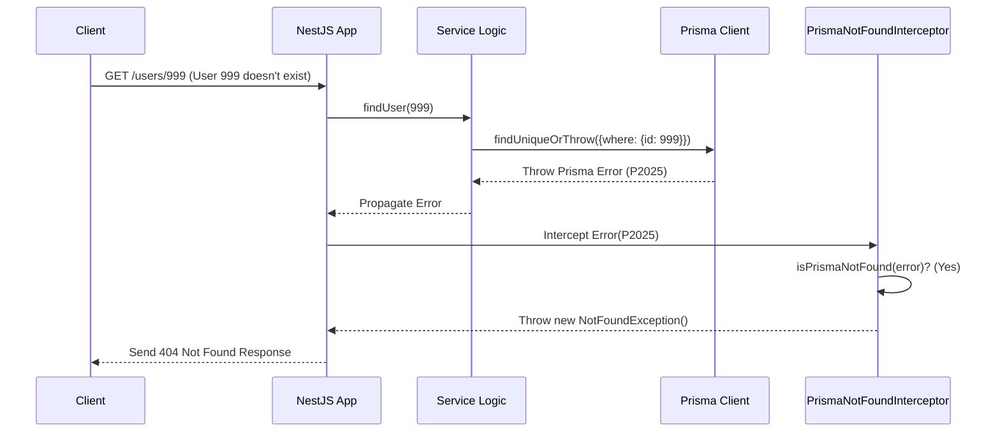

# Chapter 7: Prisma Interceptors

In [Chapter 6: Data Transfer Objects (DTOs)](06_data_transfer_objects__dtos_.md), we learned how DTOs help us define clear "forms" for data entering and leaving our API, ensuring structure and validity. Now, let's look at how we handle common issues that might pop up when our API talks to the database, specifically using Prisma (our database toolkit). This chapter introduces **Prisma Interceptors**, our automated error guards.

## Motivation: Handling Common Database Hiccups Automatically

Imagine you ask your API to find a specific user by their ID, maybe user #999. Your code might look something like this inside a service:

```typescript
// users/users.service.ts (Simplified Example)
async findUserById(id: number): Promise<User> {
  // Ask Prisma to find the user or throw an error if not found
  const user = await this.prisma.user.findUniqueOrThrow({
    where: { id },
  });
  return user;
}
```
*Explanation:* This code uses Prisma's `findUniqueOrThrow` function, which is designed to either return the user or throw a specific error if no user with that `id` exists in the database.

What happens if user #999 *doesn't* exist? Prisma throws a specific error, called `PrismaClientKnownRequestError`, with a special code `P2025` indicating "Record not found".

If we don't handle this error, it might cause our API to send back a confusing "Internal Server Error" (a 500 error) to the user, which isn't very helpful. We *could* add error handling everywhere we call `findUniqueOrThrow`:

```typescript
// users/users.service.ts (Manual Error Handling - Repetitive!)
async findUserById(id: number): Promise<User> {
  try {
    const user = await this.prisma.user.findUniqueOrThrow({
      where: { id },
    });
    return user;
  } catch (error) {
    // Check if it's the specific Prisma "Not Found" error
    if (/* check if error code is P2025 */) {
      // Throw a user-friendly "Not Found" error instead
      throw new NotFoundException(`User with ID ${id} not found.`);
    }
    // If it's some other error, let it bubble up
    throw error;
  }
}
```
*Explanation:* This code adds a `try...catch` block. It checks if the error is the specific "Not Found" error from Prisma (`P2025`) and, if so, throws a standard `NotFoundException` (which results in a user-friendly 404 error).

But doing this *every single time* we try to fetch data is repetitive and makes our code messy! We need a way to automatically catch these common Prisma errors and translate them into standard, friendly HTTP errors *across our entire application*. That's exactly what Prisma Interceptors do.

## Key Concepts: Automatic Error Translators

Let's break down how these work:

1.  **NestJS Interceptors:** In the NestJS framework (which our `api` project uses), Interceptors are like gatekeepers or middleware. They can peek at requests coming in, responses going out, and even errors that occur during processing. They can modify things or trigger side effects.

2.  **Prisma's Specific Errors:** Prisma is helpful because when something goes wrong (like not finding a record, or being unable to connect to the database), it throws errors with specific codes (like `P2025` for "Not Found" or `P1017` for "Server has closed the connection").

3.  **Our Prisma Interceptors:** These are special NestJS Interceptors we've created specifically to watch for these known Prisma error codes.
    *   **`PrismaNotFoundInterceptor`:** Watches for the `P2025` error. When it catches one, it stops the original Prisma error and throws a standard NestJS `NotFoundException` instead.
    *   **`PrismaConnectionClosedInterceptor`:** Watches for the `P1017` error (when the database connection is unexpectedly closed). When it catches this, it throws a standard `InternalServerErrorException`.

**Analogy:** Think of these interceptors as automatic translators standing between your application logic (Services) and the final response sent to the user. When Prisma shouts an error message in its own specific language (like "P2025!"), the interceptor recognizes it and translates it into a standard, widely understood message (like "404 Not Found").

## How It Works: The `PrismaNotFoundInterceptor` in Action

Because these interceptors are set up **globally** (for the entire application), they work automatically without you needing to add any special code in your services.

Let's trace our original "find user #999" scenario again, but this time *with* the interceptor active:

1.  **Request:** A request comes in, maybe `GET /users/999`.
2.  **Controller:** The `UsersController` handles the request and calls the `UsersService`.
3.  **Service:** The `UsersService` uses `prisma.user.findUniqueOrThrow({ where: { id: 999 } })`.
4.  **Prisma Error:** User #999 doesn't exist, so Prisma throws its `P2025` error.
5.  **Error Bubbles Up:** This error travels up from the service layer.
6.  **Interceptor Catches:** Before the error causes a generic server crash, the `PrismaNotFoundInterceptor` (which is always listening because it's registered globally) catches the error.
7.  **Interceptor Checks:** The interceptor looks at the error and asks, "Is this a Prisma error with code `P2025`?"

    ```typescript
    // interceptors/prisma-not-found.interceptor.ts (Simplified Logic)

    // Inside the interceptor's 'catchError' block:
    if (this.isPrismaNotFound(error)) { // Checks error code
      // If yes, throw the standard NestJS exception
      throw new NotFoundException();
    } else {
      // If no, let the original error continue
      throw error;
    }
    ```
    *Explanation:* The interceptor has a helper function (`isPrismaNotFound`) to identify the specific `P2025` error. If it matches, it throws `NotFoundException`. Otherwise, it re-throws the original error.

8.  **Translated Response:** Because the interceptor threw `NotFoundException`, NestJS automatically converts this into a standard HTTP `404 Not Found` response, which is sent back to the client.

The key benefit? The `UsersService` code remains simple and doesn't need the messy `try...catch` block. The error handling is centralized and automatic.

## Under the Hood: Global Registration and Error Catching

How is this magic set up?

**Step-by-step Flow:**

1.  A client sends a request (e.g., `GET /users/999`).
2.  NestJS routes the request to the appropriate Controller method.
3.  The Controller calls a Service method.
4.  The Service method uses a Prisma function (like `findUniqueOrThrow`).
5.  Prisma fails to find the record and throws a `PrismaClientKnownRequestError` with code `P2025`.
6.  This error propagates upwards out of the service and controller.
7.  NestJS's error handling mechanism kicks in and passes the error through any globally registered interceptors that handle errors.
8.  The `PrismaNotFoundInterceptor` receives the error.
9.  Its `catchError` logic inspects the error. The `isPrismaNotFound` helper function returns `true`.
10. The interceptor throws a `new NotFoundException()`.
11. NestJS catches this standard exception and generates the appropriate HTTP `404 Not Found` response.
12. The 404 response is sent back to the client.

**Sequence Diagram:**



**Code Dive:**

1.  **Global Registration (`api.module.ts`):**
    The interceptors are applied to the entire application in the main `ApiModule`.

    ```typescript
    // api.module.ts (Relevant parts)
    import { Module } from "@nestjs/common";
    import { APP_INTERCEPTOR } from "@nestjs/core";
    import * as interceptors from "./interceptors";
    // ... other imports ...

    @Module({
      imports: [ /* ... other modules ... */ ],
      providers: [
        // Apply PrismaNotFoundInterceptor globally
        {
          provide: APP_INTERCEPTOR,
          useClass: interceptors.PrismaNotFoundInterceptor,
        },
        // Apply PrismaConnectionClosedInterceptor globally
        {
          provide: APP_INTERCEPTOR,
          useClass: interceptors.PrismaConnectionClosedInterceptor,
        },
        // ... other providers ...
      ],
    })
    export class ApiModule {}
    ```
    *Explanation:* Using `APP_INTERCEPTOR` in the `providers` array tells NestJS to use instances of `PrismaNotFoundInterceptor` and `PrismaConnectionClosedInterceptor` for *every* incoming request and outgoing response/error in the application.

2.  **The Interceptor Code (`prisma-not-found.interceptor.ts`):**
    The interceptor implements the `NestInterceptor` interface.

    ```typescript
    // interceptors/prisma-not-found.interceptor.ts
    import { /* ... imports ... */ } from "@nestjs/common";
    import { Prisma } from "@prisma/client";
    import { Observable, throwError } from "rxjs";
    import { catchError } from "rxjs/operators";

    const Prisma_NotFound_ErrorCode = "P2025";

    @Injectable()
    export class PrismaNotFoundInterceptor implements NestInterceptor {
      intercept( /* ... */ next: CallHandler): Observable<unknown> {
        // 1. Let the request proceed normally
        return next.handle().pipe(
          // 2. If an error occurs, intercept it
          catchError((err) =>
            // 3. Check if it's the Prisma P2025 error
            throwError(() => // Helper to re-throw an error
              this.isPrismaNotFound(err)
                ? new NotFoundException() // 4a. If yes, throw NotFoundException
                : err,                    // 4b. If no, re-throw original error
            ),
          ),
        );
      }

      private isPrismaNotFound(error: unknown): boolean {
        // Check if it's the specific Prisma error P2025
        // (Actual code handles more nuances)
        return (
          error instanceof Prisma.PrismaClientKnownRequestError &&
          error.code === Prisma_NotFound_ErrorCode
        );
      }
    }
    ```
    *Explanation:*
    *   The `intercept` method is the core. `next.handle()` passes control to the next handler (e.g., the controller method).
    *   `.pipe(catchError(...))` is an RxJS operator that allows us to intercept any errors that occur during `next.handle()`.
    *   Inside `catchError`, we call our `isPrismaNotFound` helper.
    *   `throwError(() => ...)` is used to properly re-throw either our new `NotFoundException` or the original error `err`.

## Conclusion

You've learned about **Prisma Interceptors** in our `api` project!

*   They act as **automatic guards** that watch for specific errors thrown by Prisma when interacting with the database.
*   The `PrismaNotFoundInterceptor` specifically catches the `P2025` error ("Record not found") and translates it into a standard HTTP `404 Not Found` response.
*   Another interceptor, `PrismaConnectionClosedInterceptor`, handles database connection errors (`P1017`).
*   They are applied **globally**, meaning they automatically protect all relevant database operations without needing repetitive `try...catch` blocks in your services.
*   This keeps service code cleaner and ensures consistent, user-friendly error handling for common database issues across the entire application.

This concludes our journey through the core concepts of the `api` project! We've covered everything from user identity and code organization to handling requests, security, data processing, and automated error handling. Hopefully, you now have a solid foundation for understanding and working with this codebase.

---

Generated by [AI Codebase Knowledge Builder](https://github.com/The-Pocket/Tutorial-Codebase-Knowledge)