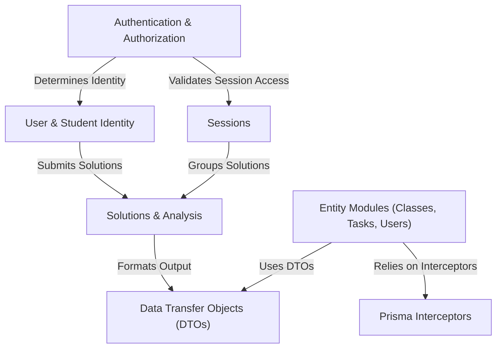

# Tutorial: api

This project is a web API for a learning platform, likely for programming education (e.g., Scratch).
It manages different types of users: *Teachers* and *Administrators* (collectively **Users**) who manage content, and **Students** who participate in learning activities.
Key features include:
- Secure **Authentication** & **Authorization** to control who can access what.
- Managing *Classes*, *Tasks* (assignments), and live learning *Sessions*.
- Handling student *Solutions* submissions for tasks, including file storage and analysis (like converting code to an Abstract Syntax Tree - AST).
- Supporting both regular logged-in students and *anonymous* participation in specific sessions.

**Source Repository:** [None](None)

## Chapters

1. [User & Student Identity
](01_user___student_identity_.md)
2. [Entity Modules (Classes, Tasks, Users)
](02_entity_modules__classes__tasks__users__.md)
3. [Sessions
](03_sessions_.md)
4. [Authentication & Authorization
](04_authentication___authorization_.md)
5. [Solutions & Analysis
](05_solutions___analysis_.md)
6. [Data Transfer Objects (DTOs)
](06_data_transfer_objects__dtos__.md)
7. [Prisma Interceptors
](07_prisma_interceptors_.md)

---

Generated by [AI Codebase Knowledge Builder](https://github.com/The-Pocket/Tutorial-Codebase-Knowledge)