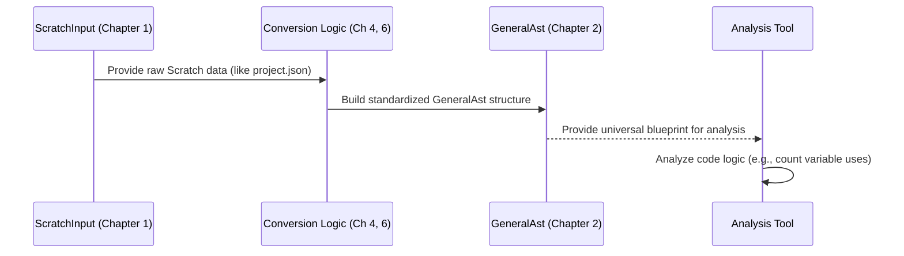

# Chapter 2: General Abstract Syntax Tree (GeneralAst)

Welcome back! In [Chapter 1: Scratch Input Representation (SB3 / ScratchInput)](01_scratch_input_representation__sb3___scratchinput__.md), we learned about `ScratchInput`, which is like the original, detailed blueprint straight from a Scratch `.sb3` file. It's very accurate, but also very specific to Scratch, with all its unique block types and structures.

But what if we want to understand the *core logic* of a program in a way that isn't tied just to Scratch? Imagine you want to build a tool that can analyze *any* kind of block-based program (starting with Scratch, maybe others later) to see, for example, how many times a certain variable is changed. Doing this directly with the `ScratchInput` format would be tricky, as we'd have to understand all the specific Scratch block names (`motion_movesteps`, `data_setvariableto`, etc.). If we wanted to analyze a different type of program later, we'd have to start all over again!

This is where the **General Abstract Syntax Tree (GeneralAst)** comes in.

## What is GeneralAst? The Universal Blueprint

Think of `GeneralAst` as a **universal translator** or a **standardized blueprint** for code. It takes the specific details from `ScratchInput` (or potentially other program formats in the future) and converts them into a common, simplified structure that represents the *essential* parts of the program's logic.

**Analogy:** Imagine `ScratchInput` is like the super-detailed, brand-specific assembly instructions for an IKEA desk. It tells you exactly which unique IKEA screw goes into which specific IKEA hole. `GeneralAst`, on the other hand, is like a more generic diagram showing "Attach leg to tabletop using a screw." It captures the *meaning* of the action (attaching a leg) in a way that could apply to assembling *any* brand of desk, not just IKEA.

The `GeneralAst` focuses on fundamental programming concepts:

1.  **Actors:** Who or what is performing actions? (In Scratch, this would be the Sprites and the Stage).
2.  **Events:** What triggers a sequence of actions? (Like "when green flag clicked" or "when I receive message").
3.  **Statements:** What are the individual actions or commands? (Like moving, changing a variable, checking a condition with `if`, repeating with `loop`).
4.  **Expressions:** What values are being calculated or referred to? (Like a number `10`, a variable `score`, or a calculation `x + 5`).

By converting Scratch code (and potentially other code) into this common `GeneralAst` format, we make it much easier to write tools that can analyze, understand, or even transform programs, regardless of how they were originally created.

## Key Parts of the GeneralAst Structure

The `GeneralAst` is built using several key types of "nodes" (building blocks). Let's look at the main ones:

1.  **`ActorNode`**: Represents an independent entity that can react to events. Think of the Stage or a Sprite in Scratch. Each `ActorNode` contains the logic associated with that actor.

    ```typescript
    // Represents a Sprite or the Stage
    interface ActorNode {
      nodeType: "actor"; // Identifies this as an Actor node
      eventListeners: EventListenerNode[]; // What events it listens for
      functionDeclarations: FunctionDeclarationNode[]; // Custom blocks (My Blocks)
      // ... maybe other actor-specific info ...
    }
    ```
    *   This defines the basic shape of an actor, holding lists of its event responses and any custom functions it defines.

2.  **`EventListenerNode`**: Represents a specific script or sequence of actions that starts when a particular event occurs.

    ```typescript
    // Represents a script like "when green flag clicked"
    interface EventListenerNode {
      nodeType: "eventListener"; // Identifies the node type
      condition: EventCondition; // What triggers this? (e.g., "green-flag")
      action: StatementSequenceNode; // What sequence of steps to run?
    }
    ```
    *   This links an `EventCondition` (like the green flag) to the `action` (the stack of blocks underneath the hat block).

3.  **`StatementNode`**: Represents a single action or control structure. This is where things like loops, conditions (`if/else`), variable assignments happen. We'll explore these in detail in [Chapter 3: General AST Nodes (`AstNode`)](03_general_ast_nodes___astnode___.md).

4.  **`ExpressionNode`**: Represents something that produces a value. This could be a fixed value (like `10` or `"hello"`), a variable (like `score`), or a calculation (like `timer + 1`). We'll also look closer at these in [Chapter 3: General AST Nodes (`AstNode`)](03_general_ast_nodes___astnode___.md).

The overall `GeneralAst` for a whole project is simply a list of all the actors:

```typescript
// File: types/general-ast/index.ts (Simplified)

// The entire GeneralAst is a list of actors
export type GeneralAst = ActorNode[];
```
*   This means a complete converted project is represented as an array, where each element describes one actor (Sprite or Stage).

## How is GeneralAst Used?

You don't typically *create* a `GeneralAst` by hand. Instead, it's the **output** of a conversion process. We feed the detailed `ScratchInput` into special converter tools (which we'll learn about in [Chapter 4: AST Conversion Service & Worker](04_ast_conversion_service___worker__.md) and [Chapter 6: Scratch Block Converters (Statement & Expression)](06_scratch_block_converters__statement___expression__.md)), and these tools automatically build the corresponding `GeneralAst`.



Once we have the `GeneralAst`, other tools can easily work with it. For example, an analysis tool could iterate through all the `StatementNode`s in the `GeneralAst` looking for variable assignments, without needing to know anything about specific Scratch block opcodes.

## Under the Hood: TypeScript Types

The structure of the `GeneralAst` is defined using TypeScript types, primarily within the `types/general-ast/` directory. We've already seen the high-level types like `GeneralAst`, `ActorNode`, and `EventListenerNode`.

Let's peek at a couple more type definitions to see how the structure is enforced:

```typescript
// File: types/general-ast/ast-node-base.ts (Simplified)
import { AstNodeType } from "./ast-node-type";

// ALL GeneralAst nodes share these basic properties
export interface AstNodeBase {
  nodeType: AstNodeType; // What kind of node is this?
  componentId?: string; // Optional: links node to a specific part
}
```
*   This `AstNodeBase` interface ensures every single node in our `GeneralAst` clearly identifies its type (actor, event, statement, or expression).

```typescript
// File: types/general-ast/ast-node-type.ts
export enum AstNodeType {
  actor = "actor",
  eventListener = "eventListener",
  statement = "statement",
  expression = "expression",
}
```
*   This `enum` defines the possible values for the `nodeType` field, making the code clearer and preventing typos.

```typescript
// File: types/general-ast/ast-nodes/event-listener-node.ts (Simplified)
import { StatementSequenceNode } from "./statement-node"; // Sequence of actions
import { ExpressionNode } from "./expression-node"; // Represents values

// Describes the event trigger
export interface EventCondition {
  event: string; // e.g., "green-flag", "message_received"
  parameters: ExpressionNode[]; // Any inputs to the event
}

// Represents a reaction to an event (a script)
export interface EventListenerNode extends AstNodeBase {
  nodeType: AstNodeType.eventListener; // It's an event listener
  condition: EventCondition; // The trigger
  action: StatementSequenceNode; // The steps to take
}
```
*   This shows how an `EventListenerNode` combines the `condition` (like `"green-flag"`) with the `action` (a `StatementSequenceNode`, which is essentially the list of steps/statements to run).

Don't worry about memorizing these details! The important takeaway is that the `GeneralAst` provides a consistent, well-defined structure based on fundamental programming concepts, making it easier to work with program logic in a general way.

## Conclusion

In this chapter, we've introduced the **General Abstract Syntax Tree (GeneralAst)**. It's our universal blueprint for representing the core structure and logic of programs, starting with Scratch. Unlike `ScratchInput` which mirrors the source format exactly, `GeneralAst` uses a standardized set of nodes (like `ActorNode`, `EventListenerNode`, `StatementNode`, `ExpressionNode`) to represent concepts common across different programming environments.

This standardized format is the output of our conversion process and serves as the ideal input for tools that need to analyze or understand program logic without being tied to the specifics of the original language (like Scratch blocks).

Now that we understand the overall goal and structure of `GeneralAst`, let's dive deeper into the building blocks it uses. In the next chapter, we'll explore the different kinds of [General AST Nodes (`AstNode`)](03_general_ast_nodes___astnode___.md) like statements and expressions in more detail.

---

Generated by [AI Codebase Knowledge Builder](https://github.com/The-Pocket/Tutorial-Codebase-Knowledge)