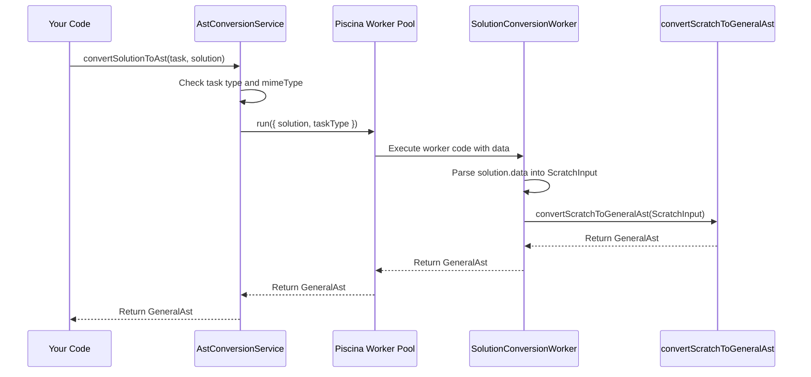

# Chapter 4: AST Conversion Service & Worker

Welcome back! In the previous chapters, we explored:

1.  [Scratch Input Representation (SB3 / ScratchInput)](01_scratch_input_representation__sb3___scratchinput__.md): The detailed blueprint directly from a Scratch file.
2.  [General Abstract Syntax Tree (GeneralAst)](02_general_abstract_syntax_tree__generalast__.md): Our universal blueprint for program logic.
3.  [General AST Nodes (`AstNode`)](03_general_ast_nodes___astnode___.md): The LEGO bricks (statements, expressions) used to build the `GeneralAst`.

Now, we face a practical question: How do we actually transform the detailed `ScratchInput` into the universal `GeneralAst`? We need a system to manage this conversion process efficiently. That's where the **AST Conversion Service & Worker** come in!

## Motivation: The Need for a Conversion Engine

Imagine you have a platform where students submit their Scratch projects. You want to automatically analyze their code using the `GeneralAst` format to check for specific patterns or give feedback.

You need a component that can:

1.  Take the raw submitted data (like the `project.json` content from a `.sb3` file).
2.  Understand that it's a Scratch project.
3.  Perform the potentially complex conversion to `GeneralAst`.
4.  Do this without slowing down the main part of your application, especially if many projects are submitted at once.

This conversion engine is exactly what the `AstConversionService` and its associated `SolutionConversionWorker` provide.

## Key Concepts: The Conversion Team

Think of the conversion process like ordering food at a busy restaurant:

1.  **`AstConversionService` (The Manager):**
    *   This is the main point of contact. You give your order (the raw project data and its type, like Scratch) to the manager.
    *   The manager figures out what needs to be done but doesn't cook the food themselves. They coordinate the process.
    *   It checks if the request is valid (e.g., "Is this really Scratch data?").

2.  **Worker Thread Pool / Piscina (The Kitchen Staff):**
    *   Converting complex projects can take time. If the manager (main application thread) did this, they couldn't take any other orders until it was finished! This would make the application unresponsive.
    *   Instead, the manager hands the order off to the kitchen staff (a pool of worker threads managed by a library called `Piscina`). These workers run separately from the main manager thread.
    *   This allows the manager to quickly get back to handling other requests while the cooks work in the background.

3.  **`SolutionConversionWorker` (The Chef):**
    *   This is the actual code that runs in a separate worker thread (one of the kitchen staff).
    *   It receives the specific order details (the raw project data) from the manager via the thread pool.
    *   Its job is to take the raw ingredients (`ScratchInput` data) and follow the correct recipe to produce the final dish (`GeneralAst`).

4.  **Specific Converter (The Recipe Book):**
    *   The chef (`SolutionConversionWorker`) needs instructions. It looks up the correct recipe based on the order type (e.g., "Scratch").
    *   For Scratch projects, it uses the `convertScratchToGeneralAst` function (which we'll explore pieces of in later chapters like [Chapter 6: Scratch Block Converters (Statement & Expression)](06_scratch_block_converters__statement___expression__.md)). This function contains the detailed steps for turning Scratch blocks into `GeneralAst` nodes.

**In short:** The `AstConversionService` receives the conversion job, hands it off to a `SolutionConversionWorker` running in a separate thread pool (Piscina) for efficiency, and the worker uses specific conversion logic to create the final `GeneralAst`.

## How to Use: Converting a Scratch Solution

Let's say you have the necessary data for a student's Scratch project submission:

*   `task`: Information about the assignment, including `task.type = TaskType.SCRATCH`.
*   `solution`: The student's submission, including `solution.mimeType = "application/json"` and `solution.data` (which contains the raw JSON string from the `project.json` file).

You would use the `AstConversionService` like this:

```typescript
// Assume 'astConversionService' is an instance you have access to
// Assume 'task' and 'solution' objects are already defined

async function performConversion(task, solution) {
  try {
    // Call the service to start the conversion
    const generalAst = await astConversionService.convertSolutionToAst(
      task,
      solution,
    );

    // Success! We now have the GeneralAst object
    console.log("Conversion successful! Got GeneralAst:", generalAst);
    // Now you can use 'generalAst' for analysis...

  } catch (error) {
    console.error("Conversion failed:", error);
  }
}
```

*   This code calls the `convertSolutionToAst` method on our service instance.
*   It passes the `task` and `solution` objects.
*   The `await` keyword means it waits for the conversion (which happens in the background worker) to complete.
*   If successful, it returns the generated `GeneralAst` object, structured according to the rules we saw in [Chapter 2: General Abstract Syntax Tree (GeneralAst)](02_general_abstract_syntax_tree__generalast__.md) and [Chapter 3: General AST Nodes (`AstNode`)](03_general_ast_nodes___astnode___.md).
*   If something goes wrong (e.g., the data isn't valid Scratch JSON), it throws an error.

## Under the Hood: The Conversion Flow

What happens step-by-step when you call `convertSolutionToAst`?

1.  **Request Received:** The `AstConversionService` gets the `task` and `solution` data.
2.  **Type Check:** It checks if the `task.type` is `SCRATCH` and the `solution.mimeType` is `application/json`. If not, it throws an error immediately.
3.  **Delegate to Worker Pool:** If the types are correct, the service packages the necessary data (`solution` object, `task.type`) and sends it to the `Piscina` worker pool using `conversionWorker.run(...)`. This is like the manager handing the order slip to the kitchen.
4.  **Worker Thread Takes Job:** Piscina assigns the job to an available worker thread. The `SolutionConversionWorker` code starts running in that separate thread.
5.  **Worker Parses Data:** The worker receives the `solution` object. It needs to read the actual JSON data, which is stored as raw bytes (`solution.data`). It decodes these bytes into a text string and then parses the string into a JavaScript object (our `ScratchInput`).
6.  **Worker Calls Specific Converter:** Now that it has the `ScratchInput` object, the worker calls the appropriate function based on the `taskType`. For Scratch, it calls `convertScratchToGeneralAst(parsedScratchInput)`. This is the chef using the Scratch recipe book.
7.  **Conversion Happens:** The `convertScratchToGeneralAst` function (and all the helper functions it uses, which we'll see later) iterates through the `ScratchInput`, processing targets, blocks, etc., and builds the `GeneralAst` structure with `ActorNode`s, `StatementNode`s, `ExpressionNode`s, etc.
8.  **Worker Returns Result:** Once the `GeneralAst` is built, the `SolutionConversionWorker` returns it.
9.  **Pool Returns Result:** Piscina sends the result (the `GeneralAst`) back from the worker thread to the main thread where the original `astConversionService.convertSolutionToAst` call was waiting.
10. **Service Returns Result:** The `AstConversionService` receives the `GeneralAst` from Piscina and returns it to your code.

Here's a simplified diagram of the flow:



## Under the Hood: Code Snippets

Let's look at simplified versions of the key files involved.

**1. `ast-conversion.service.ts` (The Manager)**

```typescript
// File: ast-conversion.service.ts (Simplified)
import { Piscina } from "piscina";
import { GeneralAst } from "./types/general-ast";
// Import worker type for type safety
import SolutionConversionWorker from "./converters/solution-conversion-worker.piscina";

type ConversionWorker = typeof SolutionConversionWorker;

export class AstConversionService {
  // Initialize the worker pool, pointing to the worker code file
  private readonly conversionWorker = new Piscina<any, GeneralAst>({
    filename: "./converters/solution-conversion-worker.piscina.js", // Compiled JS file
  });

  async convertSolutionToAst(task, solution): Promise<GeneralAst> {
    let astPromise: Promise<GeneralAst>;

    // Check if it's a Scratch task with JSON data
    if (task.type === "SCRATCH" && solution.mimeType === "application/json") {
      // Send the job to the worker pool
      astPromise = this.conversionWorker.run({
        solution: solution, // Pass the whole solution object
        taskType: task.type,
      });
    } else {
      // Handle unsupported types
      throw new Error(`Unsupported type: ${task.type}`);
    }

    // Wait for the worker to finish and return the result
    return astPromise;
  }
}
```

*   We create a `Piscina` instance, telling it where to find the worker's code (`solution-conversion-worker.piscina.js`).
*   The `convertSolutionToAst` method checks the input types.
*   Crucially, it calls `this.conversionWorker.run(...)`, passing the data the worker needs (`solution` and `taskType`). This sends the job to the background thread.
*   It returns the `Promise` returned by `run`, which will eventually resolve with the `GeneralAst`.

**2. `converters/solution-conversion-worker.piscina.ts` (The Chef)**

```typescript
// File: converters/solution-conversion-worker.piscina.ts (Simplified)
import { GeneralAst } from "../types/general-ast";
import { convertScratchToGeneralAst } from "./scratch"; // The recipe book
import ScratchInput from "../types/input/scratch"; // Type for parsed Scratch data

// This function runs in the separate worker thread
const SolutionConversionWorker = ({ solution, taskType }): GeneralAst => {
  let ast: GeneralAst;

  // Double-check the type (usually already checked by service)
  if (taskType === "SCRATCH" && solution.mimeType === "application/json") {
    // 1. Decode the raw data (Buffer) into a UTF-8 string
    const jsonString = new TextDecoder("utf-8").decode(solution.data);
    // 2. Parse the JSON string into a ScratchInput object
    const scratchInput: ScratchInput = JSON.parse(jsonString);

    // 3. Call the specific converter function (the recipe)
    ast = convertScratchToGeneralAst(scratchInput);
  } else {
    throw new Error(`Unsupported type in worker: ${taskType}`);
  }

  // Return the generated GeneralAst
  return ast;
};

export default SolutionConversionWorker; // Export the function for Piscina
```

*   This file exports a single function that Piscina will execute in the worker thread.
*   It receives the `solution` and `taskType` passed from the service's `.run()` call.
*   It performs the crucial steps: decode `solution.data`, parse it into a `ScratchInput` object.
*   It then calls `convertScratchToGeneralAst`, passing the parsed `ScratchInput`. This is where the actual heavy lifting of conversion happens (using logic we'll explore in later chapters).
*   Finally, it returns the resulting `GeneralAst`.

## Conclusion

In this chapter, we learned about the **AST Conversion Service & Worker**, the engine that drives the transformation from source formats like `ScratchInput` to our universal `GeneralAst`.

We saw that the `AstConversionService` acts as a coordinator, receiving requests and validating them. For performance, it delegates the actual conversion work to a `SolutionConversionWorker` running in a separate thread pool (`Piscina`). The worker parses the input data and calls the appropriate specific converter function (like `convertScratchToGeneralAst`) to build the final `GeneralAst`. This separation keeps the main application responsive while handling potentially intensive conversion tasks.

Now that we understand *how* the conversion is orchestrated, we need to look deeper into the "recipe" used for Scratch. How does `convertScratchToGeneralAst` actually work with the complex structure of Scratch blocks? The first step is often to organize the blocks within a Sprite into a more manageable tree structure.

In the next chapter, we'll explore the concept used for this initial organization: [Scratch Block Tree (`BlockTree`)](05_scratch_block_tree___blocktree___.md).

---

Generated by [AI Codebase Knowledge Builder](https://github.com/The-Pocket/Tutorial-Codebase-Knowledge)