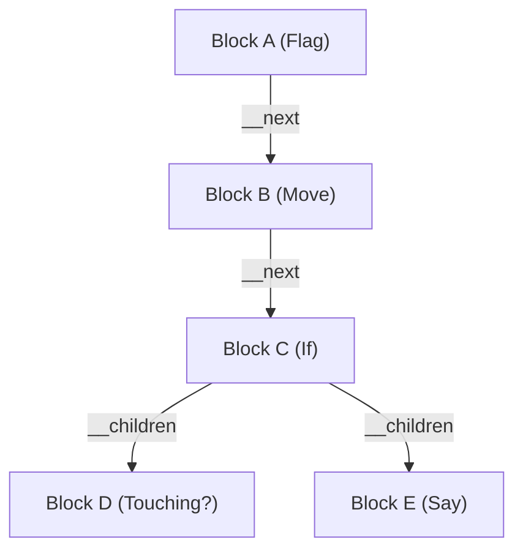
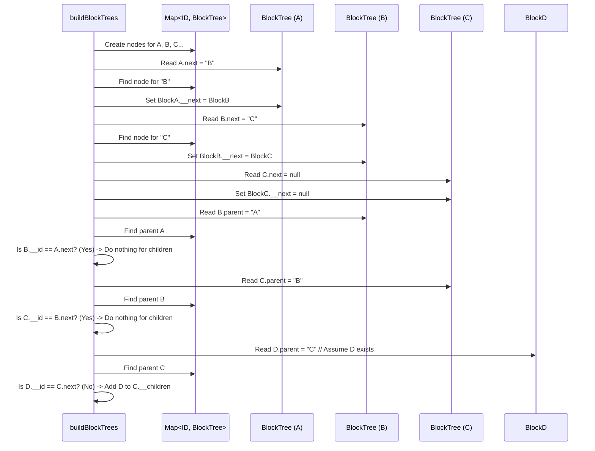

# Chapter 5: Scratch Block Tree (`BlockTree`)

Welcome back! In [Chapter 4: AST Conversion Service & Worker](04_ast_conversion_service___worker__.md), we saw how the `AstConversionService` takes the raw project data (like `ScratchInput`) and hands it off to a worker to convert it into our universal `GeneralAst`.

But how does that worker actually make sense of the Scratch blocks? Remember from [Chapter 1: Scratch Input Representation (SB3 / ScratchInput)](01_scratch_input_representation__sb3___scratchinput__.md) that Scratch stores blocks in a somewhat jumbled way – a flat list where blocks refer to each other using IDs (`next`, `parent`, `inputs`). Directly converting this flat list into the structured `GeneralAst` ([Chapter 2: General Abstract Syntax Tree (GeneralAst)](02_general_abstract_syntax_tree__generalast__.md)) would be quite difficult.

We need an intermediate step to organize these blocks first. That's where the **Scratch Block Tree (`BlockTree`)** comes in!

## Motivation: Untangling the Block List

Imagine you have a Scratch script like this:

```scratch
when green flag clicked
move (10) steps
if <touching [edge v]?> then
  say [Ouch!] for (1) secs
end
```

In the `ScratchInput`, these blocks aren't stored in this nice visual order. They're in a flat list, maybe something like this (simplified):

```json
{
  "block_A": { "opcode": "event_whenflagclicked", "next": "block_B", ... },
  "block_B": { "opcode": "motion_movesteps", "next": "block_C", "parent": "block_A", "inputs": { "STEPS": [ ... "10" ... ] }, ... },
  "block_C": { "opcode": "control_if", "next": null, "parent": "block_B", "inputs": { "CONDITION": ["block_D"], "SUBSTACK": ["block_E"] }, ... },
  "block_D": { "opcode": "sensing_touchingobject", "parent": "block_C", "inputs": { "TOUCHINGOBJECTMENU": [...] }, ... },
  "block_E": { "opcode": "looks_sayforsecs", "parent": "block_C", "inputs": { "MESSAGE": [... "Ouch!" ...], "SECS": [... "1" ...] }, ... }
}
```

See how `block_D` (touching edge?) and `block_E` (say Ouch!) both have `block_C` (the `if` block) as their `parent`? And how blocks link using `next` and `parent` IDs? Trying to figure out the script's flow directly from this flat list is like trying to assemble IKEA furniture when all the instructions are cut into individual sentences and thrown in a box!

The `BlockTree` abstraction solves this by reorganizing the flat list into a tree structure that mirrors the visual layout of the script *before* we convert it to the final `GeneralAst`.

## Key Concepts: Building the Tree

1.  **What is `BlockTree`?**
    *   It's an **intermediate data structure** used internally during the conversion process.
    *   It represents a *single stack* of connected Scratch blocks (a script) as a tree.
    *   Each node in the `BlockTree` corresponds to one Scratch block from the `ScratchInput`.

2.  **Node Structure:**
    *   Each `BlockTree` node holds the **original block data** (opcode, inputs, fields, etc.).
    *   It adds special pointers to represent the script's structure:
        *   `__next`: Points to the `BlockTree` node for the block directly *below* it in the sequence. (e.g., `move steps` points to `if`). If it's the last block in a sequence, `__next` is `null`.
        *   `__children`: A list containing `BlockTree` nodes for blocks that are *nested inside* the current block. This is used for:
            *   Conditions plugged into control blocks (like the `touching edge?` block inside the `if`).
            *   Value blocks plugged into inputs (like the `10` in `move (10) steps`).
            *   Blocks inside C-shaped blocks (like the `say` block inside the `if`).

3.  **Analogy Revisited:**
    *   `ScratchInput`: The jumbled box of individual IKEA instruction sentences.
    *   `BlockTree`: Organizing those sentences into logical, step-by-step instruction sequences for each part of the furniture (like "Instructions for attaching Leg A", "Instructions for adding Shelf B").
    *   `GeneralAst`: The final, universal assembly diagram that shows the *meaning* ("Attach leg to tabletop"), not tied to specific IKEA parts.

The `BlockTree` makes it much easier to walk through a script in the correct order and understand which blocks belong inside others.

## How it's Used: Building the Tree Internally

You typically don't create or interact with `BlockTree`s directly in your own code. They are created and used *inside* the `convertScratchToGeneralAst` function (which we learned is called by the [Chapter 4: AST Conversion Service & Worker](04_ast_conversion_service___worker__.md)).

The process of building the `BlockTree` from the flat `ScratchInput.blocks` looks roughly like this:

1.  **Create Nodes:** For every block ID in the `ScratchInput`'s block list for a specific Sprite/Stage, create a basic `BlockTree` node. Copy the block's data and add `__next = null` and `__children = []`. Store these nodes in a temporary map where the key is the block ID.
2.  **Link Nodes:** Go through each created `BlockTree` node:
    *   **Link `__next`:** Look at the original block's `next` ID. If it exists, find the corresponding node in the map and set the current node's `__next` pointer to it.
    *   **Link `__children`:** Look at the original block's `parent` ID. If it exists, find the corresponding *parent* node in the map. **Important Check:** If the current block is *already* the `__next` block of the parent, we *don't* add it as a child (it's part of the main sequence). Otherwise (meaning it's nested inside an input or substack), add the current node to the `parent` node's `__children` list.
3.  **Find Roots:** Identify the nodes that *don't* have a `parent`. These are typically the "hat" blocks (like `when green flag clicked`) that start scripts. These root nodes become the starting points for traversing the structured scripts.

Let's visualize this transformation for our example:

**Flat `ScratchInput` blocks:**

```
 A -> B -> C
        |
        +-> D (condition for C)
        |
        +-> E (substack for C)
```

**Resulting `BlockTree` Structure (Starting from Root A):**



Notice how `D` and `E` are now clearly organized as `__children` of `C` (the `if` block), while `A`, `B`, and `C` follow the `__next` links for the main sequence.

## Under the Hood: Implementation Details

The logic for building these trees resides mainly in the `buildBlockTrees` function within the Scratch converter code.

**Step-by-Step Walkthrough (`buildBlockTrees`):**

1.  **Input:** Takes the `blocks` object (a map of block IDs to block data) for a specific target (Sprite or Stage) from the `ScratchInput`.
2.  **Create Node Map:** Creates a new map (`blockTreeNodeById`) where each block ID maps to a new `BlockTree` object. This object includes the original block data plus `__id`, `__children: []`, and `__next: null`.
3.  **Link `__next`:** Iterates through the `blockTreeNodeById` map. For each node, it reads the `next` ID from the original block data. If `next` exists, it finds the node corresponding to that ID in the map and assigns it to the current node's `__next` property.
4.  **Link `__children` & Identify Roots:** Iterates through the map again. For each node:
    *   Reads the `parent` ID from the original block data.
    *   If `parent` exists: Finds the `parentBlock` node in the map. It checks if the current block (`block.__id`) is *different* from the `parentBlock.next` ID. If they are different, it means the current block is nested (not just the next in sequence), so it pushes the current `block` node onto the `parentBlock.__children` array.
    *   If `parent` does *not* exist: This block is a potential starting point for a script. It adds this `block` node to a list called `roots`.
5.  **Output:** Returns the `roots` list, which contains the top-level `BlockTree` nodes for all scripts belonging to that target.

**Diagram of Linking Process:**



**Code Snippets:**

First, let's look at the type definition for a `BlockTree` node. It includes the original `Block` data plus our special structural fields:

```typescript
// File: converters/scratch/types.ts (Simplified)

import { Block } from "src/ast/types/input/scratch/generated/sb3";
// ... other imports

// Base structure added to every BlockTree node
export type TreeNode = {
  __id: string; // The block's original ID
  __children: NonHatBlockTree[]; // Nested blocks (inputs, conditions)
  __next: StatementBlockTree | null; // The next block in sequence
};

// A BlockTree node combines original Block data with TreeNode structure
export type BlockTree = Block & TreeNode;

// More specific types for different kinds of blocks...
export type StatementBlockTree = /* ... */ & TreeNode;
export type NonHatBlockTree = /* ... */ & TreeNode;
```
*   This shows how `BlockTree` merges the original `Block` type with our `TreeNode` structure containing `__id`, `__children`, and `__next`.

Now, a *very simplified* look at the `buildBlockTrees` logic:

```typescript
// File: converters/scratch/scratch-ast-converter.ts (Simplified `buildBlockTrees`)

import { Block } from "src/ast/types/input/scratch/generated/sb3";
import { BlockTree } from "./types";
// ... other imports

const buildBlockTrees = (blocks: { [id: string]: Block }): BlockTree[] => {
  // 1. Create node map (simplified)
  const blockTreeNodeById: { [id: string]: BlockTree } = {};
  for (const [id, blockData] of Object.entries(blocks)) {
    blockTreeNodeById[id] = {
      ...blockData, // Copy original data
      __id: id,
      __children: [], // Initialize empty children
      __next: null,   // Initialize null next
    };
  }

  const roots: BlockTree[] = [];

  // 2. Link nodes (__next and __children)
  for (const blockNode of Object.values(blockTreeNodeById)) {
    // Link __next (simplified)
    const nextId = blockNode.next;
    if (nextId && blockTreeNodeById[nextId]) {
      blockNode.__next = blockTreeNodeById[nextId];
    }

    // Link __children and find roots (simplified)
    const parentId = blockNode.parent;
    if (parentId && blockTreeNodeById[parentId]) {
      const parentNode = blockTreeNodeById[parentId];
      // Check if it's NOT the next block before adding as child
      if (parentNode.next !== blockNode.__id) {
        parentNode.__children.push(blockNode);
      }
    } else {
      // No parent? It's a root block.
      roots.push(blockNode);
    }
  }

  // 3. Return the roots
  return roots;
};
```
*   This simplified code shows the core steps: creating the map, iterating to link `__next`, and iterating again to link `__children` (only if it's not the `next` block) and identify `roots`.

## Conclusion

In this chapter, we explored the **Scratch Block Tree (`BlockTree`)**. We learned it's an essential, internal, intermediate data structure created during the conversion process. Its purpose is to reorganize the flat list of blocks found in `ScratchInput` into a tree-like structure that mirrors the visual layout and logical flow of Scratch scripts.

Each `BlockTree` node holds the original block data along with `__next` (pointing to the sequential block below) and `__children` (pointing to nested blocks like inputs, conditions, or substacks). This organized structure makes it much easier for the conversion process to traverse the scripts correctly.

Now that we have our scripts organized into `BlockTree`s, how do we actually convert these trees into the final [GeneralAst](02_general_abstract_syntax_tree__generalast__.md) format using [AstNode](03_general_ast_nodes___astnode___.md)s? That's the job of specific converter functions.

In the next chapter, we'll dive into how these converters work: [Chapter 6: Scratch Block Converters (Statement & Expression)](06_scratch_block_converters__statement___expression__.md).

---

Generated by [AI Codebase Knowledge Builder](https://github.com/The-Pocket/Tutorial-Codebase-Knowledge)