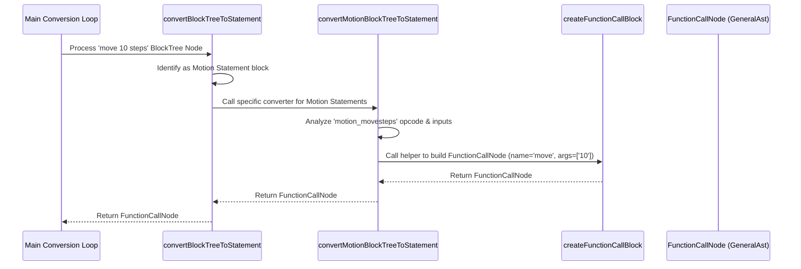

# Chapter 6: Scratch Block Converters (Statement & Expression)

Welcome back! In [Chapter 5: Scratch Block Tree (`BlockTree`)](05_scratch_block_tree___blocktree___.md), we learned how the conversion process organizes the flat list of Scratch blocks into a more structured `BlockTree` for each script. This tree mirrors the visual layout we see in Scratch.

But how do we get from that organized `BlockTree` to our final goal, the universal [General Abstract Syntax Tree (GeneralAst)](02_general_abstract_syntax_tree__generalast__.md)? The `BlockTree` still uses Scratch-specific block types (like `motion_movesteps`). We need to translate these into the general concepts defined by our [General AST Nodes (`AstNode`)](03_general_ast_nodes___astnode___.md), such as function calls, variable assignments, or literal values.

This crucial translation step is handled by a set of functions we call **Scratch Block Converters**.

## Motivation: Translating Individual Blocks

Imagine we have this simple `BlockTree` node representing the "move 10 steps" block:

```typescript
// Simplified BlockTree node for 'move 10 steps'
const moveBlockNode: BlockTree = {
  opcode: "motion_movesteps",
  inputs: { STEPS: [/* Input representing '10' */] },
  // ... other block data ...
  __id: "block_B",
  __next: /* BlockTree node for block below */,
  __children: [/* BlockTree node for '10' if it's a block */]
};
```

We need a specific piece of code that knows: "Aha! This `motion_movesteps` block represents a general 'function call' action. The function name is 'move', and it takes one argument, which is the value '10'."

This specific piece of code is a **Block Converter**.

## Key Concepts: The Translation Team

Think of the conversion from `BlockTree` to `GeneralAst` as translating a book written in a very specific dialect (Scratch blocks) into a universal language (`GeneralAst`). You wouldn't use just one translator for the whole book; you'd likely have specialists.

1.  **The Core Translation Job:** Block converters are functions that take a single `BlockTree` node as input and produce the corresponding `GeneralAst` node (or sometimes a list of nodes, like for loops) as output. They contain the core logic for understanding what each Scratch block *means* in general programming terms.

2.  **Specialized Translators (By Category):** Just like Scratch groups blocks into categories (Motion, Looks, Sound, Control, Operators, Data, etc.), our converters are often organized similarly. There might be a `convertMotionBlockTreeToStatement` function, a `convertLooksBlockTreeToExpression` function, and so on. This keeps the logic organized.

3.  **Statements vs. Expressions:** This is a vital distinction!
    *   **Statement Converters:** Handle blocks that perform an *action* but don't produce a value themselves (like `move 10 steps`, `say "Hello"`, `set score to 0`, `if <condition> then`). These converters typically produce `StatementNode`s in the `GeneralAst` (like `FunctionCallNode`, `VariableAssignmentNode`, `ConditionNode`).
    *   **Expression Converters:** Handle blocks that represent a *value* (like `10`, `"Hello"`, `score`, `x position`, `timer`, `mouse x`, `(a + b)`). These converters produce `ExpressionNode`s in the `GeneralAst` (like `LiteralNode`, `VariableNode`, `OperatorNode`, `FunctionCallExpressionNode`).

**Analogy:** Imagine you have different translators for different types of phrases:
*   A "Command Translator" (like a **Statement Converter**) translates "Move 10 steps!" into the universal command structure.
*   A "Calculation Translator" (like an **Expression Converter**) translates "(5 + 3)" into the universal calculation structure.
*   A "Question Translator" (another **Expression Converter**) translates "What is the score?" into the universal structure for accessing a variable's value.

## How it Works: The Conversion Pipeline

When the main conversion logic (from [Chapter 4: AST Conversion Service & Worker](04_ast_conversion_service___worker__.md), specifically `convertScratchToGeneralAst`) walks through a `BlockTree`, it needs to decide *which* converter to use for each node.

1.  **Traversal:** The process iterates through the `BlockTree` nodes, usually following the `__next` pointers for sequential blocks.
2.  **Dispatching:** For each `BlockTree` node, it calls a central "dispatcher" function (like `convertBlockTreeToStatement` or `convertBlockTreeToExpression`).
3.  **Identification:** The dispatcher function looks at the block's `opcode` (e.g., `"motion_movesteps"`, `"operator_add"`) or uses helper functions (which we'll see in [Chapter 7: Scratch Block Type Predicates (`is...Block`)](07_scratch_block_type_predicates___is___block__.md)) to figure out:
    *   Is this a Statement or an Expression block?
    *   Which category does it belong to (Motion, Operator, Data, etc.)?
4.  **Calling the Specialist:** Based on the identification, the dispatcher calls the appropriate *specific* converter function (e.g., `convertMotionBlockTreeToStatement` for a Motion statement block, `convertOperatorBlockTreeToExpression` for an Operator expression block).
5.  **Translation:** The specific converter function takes the `BlockTree` node, analyzes its `opcode`, `inputs`, `fields`, and `__children`, and constructs the corresponding `GeneralAst` node (`AstNode`).
6.  **Result:** The specific converter returns the generated `AstNode`, which the main process adds to the overall `GeneralAst` being built.

Here's a simplified flow for converting a `motion_movesteps` block:



## Code Examples: Statement & Expression Converters

Let's look at *highly simplified* examples of what these converters might do.

**1. Statement Converter Example (`motion_movesteps`)**

This function handles translating the `move 10 steps` block.

```typescript
// Simplified converter for 'motion_movesteps'
// File: converters/scratch/scratch-motion-block-converter.ts (Conceptual)

import { StatementNode } from "src/ast/types/general-ast/ast-nodes";
import { BlockTree } from "./types";
import { createFunctionCallBlock, convertInputsToExpression } from "./helpers"; // Assumed helpers

function convertMotionMoveSteps(block: BlockTree): StatementNode {
  // Use a helper to create a GeneralAst FunctionCallNode
  // 'createFunctionCallBlock' likely handles extracting arguments
  return createFunctionCallBlock(block, "move"); // Map "motion_movesteps" to "move"
}
```

*   **Input:** A `BlockTree` node for a `motion_movesteps` block.
*   **Logic:** It recognizes the block and uses a helper (`createFunctionCallBlock`) to create a `FunctionCallNode` for the `GeneralAst`.
    *   The helper likely figures out the function name (`"move"`) and uses another helper (`convertInputsToExpression`) to convert the "STEPS" input (which is `10`) into a `LiteralNode(10)`.
*   **Output:** A `GeneralAst` `FunctionCallNode` representing the action.

**2. Expression Converter Example (`motion_xposition`)**

This function handles translating the `(x position)` block.

```typescript
// Simplified converter for 'motion_xposition'
// File: converters/scratch/scratch-motion-block-converter.ts (Conceptual)

import { ExpressionNode } from "src/ast/types/general-ast/ast-nodes/expression-node";
import { BlockTree } from "./types";
import { createVariableExpressionBlock } from "./helpers"; // Assumed helper

function convertMotionXPosition(block: BlockTree): ExpressionNode {
  // 'x position' acts like reading a built-in variable.
  // Use a helper to create a GeneralAst VariableNode.
  return createVariableExpressionBlock("motion_xposition"); // Use opcode as variable name
}
```

*   **Input:** A `BlockTree` node for a `motion_xposition` block.
*   **Logic:** It recognizes this block represents reading a value. It uses a helper (`createVariableExpressionBlock`) to create a `VariableNode` in the `GeneralAst`.
*   **Output:** A `GeneralAst` `VariableNode` representing the value.

**3. Dispatcher Example (`convertBlockTreeToStatement`)**

This function routes a block to the correct *statement* converter.

```typescript
// Simplified dispatcher for Statement blocks
// File: converters/scratch/scratch-block-statement-converter.ts (Conceptual)

import { StatementNode } from "src/ast/types/general-ast";
import { BlockTree, StatementBlockTree } from "./types";
import { isMotionStatementBlock, convertMotionBlockTreeToStatement } from "./scratch-motion-block-converter";
import { isLooksStatementBlock, convertLooksBlockTreeToStatement } from "./scratch-looks-block-converter";
// ... imports for other categories ...

export const convertBlockTreeToStatement = (block: StatementBlockTree): StatementNode[] => {
  // Use 'match' or if/else with type predicates (Chapter 7)
  if (isMotionStatementBlock(block)) {
    // Found a Motion statement block, call its converter
    return convertMotionBlockTreeToStatement(block);
  } else if (isLooksStatementBlock(block)) {
    // Found a Looks statement block...
    return convertLooksBlockTreeToStatement(block);
  } // ... handle other categories ...
  else {
    // Fallback or error for unknown blocks
    console.warn("Unknown statement block:", block.opcode);
    return [];
  }
};
```

*   **Input:** A `BlockTree` node that is known to be a statement block.
*   **Logic:** It uses helper functions like `isMotionStatementBlock` (from [Chapter 7: Scratch Block Type Predicates (`is...Block`)](07_scratch_block_type_predicates___is___block__.md)) to check the block's category. Based on the category, it calls the corresponding specific converter function (e.g., `convertMotionBlockTreeToStatement`).
*   **Output:** An array of `StatementNode`s returned by the specific converter (often just one, but loops might generate more).

There's a similar dispatcher function, `convertBlockTreeToExpression`, for routing expression blocks.

## Under the Hood: Implementation Details

*   **Location:** The core logic resides in files like:
    *   `converters/scratch/scratch-block-statement-converter.ts`: The main dispatcher for statement blocks.
    *   `converters/scratch/scratch-block-expression-converter.ts`: The main dispatcher for expression blocks.
    *   `converters/scratch/scratch-block-input-converter.ts`: Helper for converting block inputs (like the `10` in `move 10 steps`) into `ExpressionNode`s.
    *   Category-specific files (e.g., `converters/scratch/scratch-motion-block-converter.ts`, `converters/scratch/scratch-operator-block-converter.ts`, etc.): Contain the actual conversion logic for blocks in that category.
    *   `converters/scratch/helpers.ts`: Contains utility functions like `createFunctionCallBlock`, `createLiteralNode`, `createVariableExpressionBlock` to simplify creating `GeneralAst` nodes.
*   **Routing:** The dispatcher functions (`convertBlockTreeToStatement`, `convertBlockTreeToExpression`) often use a library like `ts-pattern` (or simple `if/else if` chains) along with type predicate functions (`isMotionStatementBlock`, `isOperatorExpressionBlock`, etc. - see Chapter 7) to determine which specific converter function to call based on the input `BlockTree` node's `opcode` and structure.
*   **Recursion:** Converting inputs often involves recursion. For example, converting the `operator_add` block (`_ + _`) requires recursively calling `convertBlockTreeToExpression` for the blocks plugged into its left and right input slots.

## Conclusion

In this chapter, we learned about the **Scratch Block Converters**. These are the specialized functions that perform the core translation work, taking nodes from the intermediate [Scratch Block Tree (`BlockTree`)](05_scratch_block_tree___blocktree___.md) and converting them into corresponding [General AST Nodes (`AstNode`)](03_general_ast_nodes___astnode___.md).

We saw that there are different converters for different Scratch block categories (Motion, Looks, Control, etc.) and a crucial distinction between converters for **Statements** (actions) and **Expressions** (values). Dispatcher functions route each block to the correct converter, which then builds the appropriate piece of the final [General Abstract Syntax Tree (GeneralAst)](02_general_abstract_syntax_tree__generalast__.md).

But how do those dispatcher functions reliably figure out what *kind* of block they're looking at? They use special helper functions called "type predicates".

In the next chapter, we'll explore these helpers: [Chapter 7: Scratch Block Type Predicates (`is...Block`)](07_scratch_block_type_predicates___is___block__.md).

---

Generated by [AI Codebase Knowledge Builder](https://github.com/The-Pocket/Tutorial-Codebase-Knowledge)