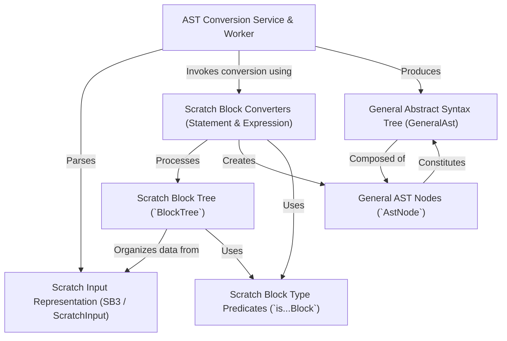

# Tutorial: ast

This project converts *Scratch 3.0* project files (`.sb3`) into a **standardized Abstract Syntax Tree (AST)** format, called the `GeneralAst`.
The process starts by receiving the Scratch project data, parsing it, and organizing Scratch's flat list of blocks into a more structured **block tree**.
Specialized *converter functions* then traverse this tree, translating each Scratch block (like loops, conditions, or variable operations) into corresponding nodes within the final `GeneralAst`.
This standardized `GeneralAst` makes it easier to programmatically analyze and understand the logic of Scratch projects.

**Source Repository:** [None](None)

## Chapters

1. [Scratch Input Representation (SB3 / ScratchInput)
](01_scratch_input_representation__sb3___scratchinput__.md)
2. [General Abstract Syntax Tree (GeneralAst)
](02_general_abstract_syntax_tree__generalast__.md)
3. [General AST Nodes (`AstNode`)
](03_general_ast_nodes___astnode___.md)
4. [AST Conversion Service & Worker
](04_ast_conversion_service___worker_.md)
5. [Scratch Block Tree (`BlockTree`)
](05_scratch_block_tree___blocktree___.md)
6. [Scratch Block Converters (Statement & Expression)
](06_scratch_block_converters__statement___expression__.md)
7. [Scratch Block Type Predicates (`is...Block`)
](07_scratch_block_type_predicates___is___block___.md)

---

Generated by [AI Codebase Knowledge Builder](https://github.com/The-Pocket/Tutorial-Codebase-Knowledge)